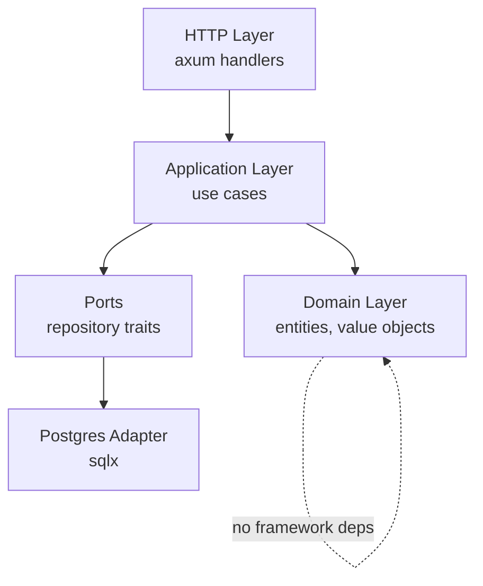

# VEYRA

```
 __   __  _______  __   __  ______    _______ 
|  | |  ||       ||  | |  ||    _ |  |   _   |
|  |_|  ||    ___||  |_|  ||   | ||  |  |_|  |
|       ||   |___ |       ||   |_||_ |       |
|       ||    ___||_     _||    __  ||       |
 |     | |   |___   |   |  |   |  | ||   _   |
  |___|  |_______|  |___|  |___|  |_||__| |__|
```

**Open-source vehicle management API built with Rust.**


Track your vehicles, services, fuel, and expenses — all in one clean API.

## Architecture

Hexagonal DDD (Ports & Adapters) in a single Rust crate. Domain layer is
framework-free and tested in isolation. CI script enforces that `domain/`,
`application/`, and `ports/` never import `axum` or `sqlx`.



## Features

- 🚗 Multi-vehicle tracking per account
- 🔧 Service history with cost tracking
- ⛽ Fuel consumption logs with efficiency metrics
- 💸 Expense categorization (tire, battery, tax, insurance, other)
- 🔔 Maintenance reminders (by date, odometer, or both)
- 📄 Document tracker (STNK, BPKB, insurance — expiry alerts)
- 📊 Per-vehicle dashboard summary
- 🔒 JWT authentication (Argon2id passwords)

## Quick Start

```bash
git clone https://github.com/oksasatya/veyra && cd veyra
cp apps/backend/.env.example apps/backend/.env
docker compose up -d
# Wait for health check to pass, then:
curl http://localhost:3000/health
# {"status":"ok","version":"0.1.0"}
```

## API Overview

| Method | Path | Description |
|--------|------|-------------|
| POST | /auth/register | Register new account |
| POST | /auth/login | Login, get JWT |
| GET | /me | Current user |
| GET/POST | /vehicles | List / create vehicles |
| GET/PUT/DELETE | /vehicles/{id} | Get / update / delete |
| GET | /vehicles/{id}/summary | Dashboard aggregation |
| GET/POST | /vehicles/{id}/services | Service history |
| GET/POST | /vehicles/{id}/fuel-logs | Fuel logs |
| GET/POST | /vehicles/{id}/expenses | Expenses |
| GET/POST | /vehicles/{id}/reminders | Reminders |
| PATCH | /vehicles/{id}/reminders/{rid} | Mark complete |
| GET/POST | /vehicles/{id}/documents | Documents |

## Tech Stack

| Layer | Tech |
|-------|------|
| Runtime | tokio |
| Web | axum 0.8 |
| Database | PostgreSQL 17 + sqlx 0.8 |
| Auth | JWT (jsonwebtoken) + Argon2id |
| Config | figment |
| Testing | cargo nextest + testcontainers |

## Roadmap

- [x] v0.1 — Scaffolding + health
- [x] v0.2 — Auth
- [x] v0.3 — Vehicle CRUD
- [x] v0.4 — Service records
- [x] v0.5 — Fuel + expense logs
- [x] v0.6 — Reminders
- [x] v0.7 — Dashboard summary
- [ ] v0.8 — React frontend
- [ ] v0.9 — OpenAPI 3.1 spec
- [ ] v1.0 — Stable MVP

## Contributing

PRs welcome. Open an issue first for significant changes.

## License

MIT — see [LICENSE](LICENSE).
