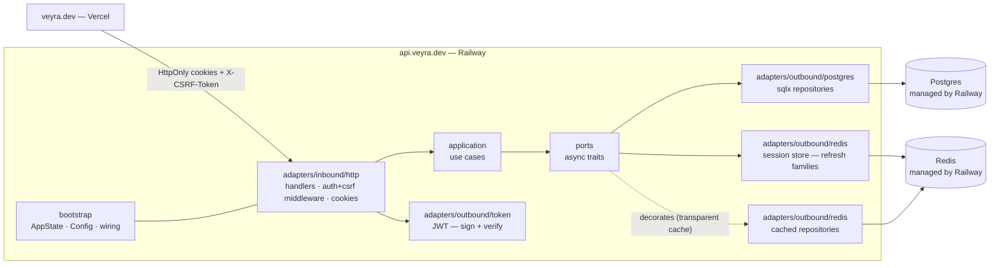

# VEYRA

```
 __   __  _______  __   __  ______    _______ 
|  | |  ||       ||  | |  ||    _ |  |   _   |
|  |_|  ||    ___||  |_|  ||   | ||  |  |_|  |
|       ||   |___ |       ||   |_||_ |       |
|       ||    ___||_     _||    __  ||       |
 |     | |   |___   |   |  |   |  | ||   _   |
  |___|  |_______|  |___|  |___|  |_||__| |__|
```

**Open-source vehicle management API built with Rust.**


Track your vehicles, services, fuel, and expenses — all in one clean API.

---

## Architecture

Hexagonal DDD (Ports & Adapters) in a single Rust crate. The domain layer is
framework-free and tested in isolation. A CI script enforces that `domain/`,
`application/`, and `ports/` never import `axum`, `sqlx`, or `serde`.

### Layer diagram



### Hexagonal layer boundaries (CI-enforced)

| Layer | May import | Forbidden |
|---|---|---|
| `domain/` | stdlib, thiserror, uuid, chrono, rust_decimal | axum, sqlx, serde, tokio |
| `application/` | domain, ports | axum, sqlx |
| `ports/` | domain only | axum, sqlx, serde |
| `adapters/inbound/http/` | application, ports, axum, serde | sqlx directly |
| `adapters/outbound/postgres/` | ports, sqlx | axum |
| `adapters/outbound/redis/` | ports, fred, sha2 | axum |
| `bootstrap/` | all | — |

---

## Features

- Multi-vehicle tracking per account
- Service history with cost tracking
- Fuel consumption logs with efficiency metrics
- Expense categorization (tire, battery, tax, insurance, other)
- Maintenance reminders (by date, odometer, or both)
- Document tracker (STNK, BPKB, insurance — expiry alerts)
- Per-vehicle dashboard summary (cached in Redis)
- Secure cookie-based authentication with rotating refresh tokens and CSRF protection

---

## Quick Start

```bash
git clone https://github.com/oksasatya/veyra && cd veyra
cp apps/backend/.env.example apps/backend/.env
# Edit .env: set DATABASE_URL, REDIS_URL, JWT_SECRET (min 32 chars)
docker compose up -d
# Wait for the health check to pass:
curl http://localhost:3000/health
# {"status":"ok","version":"0.1.0"}
```

---

## Tech Stack

| Layer | Tech |
|---|---|
| Runtime | tokio |
| Web | axum 0.8 + axum-extra 0.10 (cookie) |
| Database | PostgreSQL 17 + sqlx 0.8 |
| Cache / Session | Redis + fred 10 |
| Auth | JWT (jsonwebtoken 9) + Argon2id + rotating refresh tokens |
| Config | figment |
| Testing | cargo nextest + testcontainers (Postgres + Redis) |

---

## API Overview

| Method | Path | Auth | Description |
|---|---|---|---|
| POST | /auth/register | — | Register; sets access, refresh, and CSRF cookies |
| POST | /auth/login | — | Login; sets access, refresh, and CSRF cookies |
| POST | /auth/refresh | refresh cookie + CSRF | Rotate refresh token; issues new access token |
| POST | /auth/logout | access cookie + CSRF | Revoke session; clears all cookies |
| GET | /me | access cookie | Current user info |
| GET / POST | /vehicles | access cookie + CSRF | List / create vehicles |
| GET / PUT / DELETE | /vehicles/{id} | access cookie + CSRF | Get / update / delete |
| GET | /vehicles/{id}/summary | access cookie | Dashboard aggregation (cached) |
| GET / POST | /vehicles/{id}/services | access cookie + CSRF | Service history |
| GET / POST | /vehicles/{id}/fuel-logs | access cookie + CSRF | Fuel logs |
| GET / POST | /vehicles/{id}/expenses | access cookie + CSRF | Expenses |
| GET / POST | /vehicles/{id}/reminders | access cookie + CSRF | Reminders |
| PATCH | /vehicles/{id}/reminders/{rid} | access cookie + CSRF | Mark reminder complete |
| GET / POST | /vehicles/{id}/documents | access cookie + CSRF | Documents |
| GET | /health | — | Liveness probe |

---

## Authentication

Veyra uses **short-lived access tokens + rotating refresh tokens**, both delivered as
HttpOnly cookies. There is no `Authorization: Bearer` header and no token in response bodies.

### Token model

| Token | Form | Lifetime | Transport |
|---|---|---|---|
| Access | JWT HS256, claims `{ sub, sid, jti, iat, exp }` | 15 min (configurable) | HttpOnly cookie |
| Refresh | Opaque `{family_id}.{raw_secret}` | 7 days (configurable) | HttpOnly cookie, `Path=/auth` |
| CSRF | Random base64url, readable by JS | >= refresh lifetime | Non-HttpOnly cookie |

The access JWT embeds `sid` — the refresh family ID. A single `revoked:{sid}` Redis key invalidates
all access tokens of a session simultaneously (reuse detected, logout, or explicit revoke).

### CSRF protection

All mutating protected routes require an `X-CSRF-Token` header that matches the `veyra_csrf` cookie
value (double-submit pattern). The `/auth/register` and `/auth/login` endpoints are exempt (no session
exists yet). The `/auth/refresh` and `/auth/logout` endpoints enforce CSRF.

### Refresh rotation

`POST /auth/refresh` atomically rotates the refresh secret (Lua CAS on Redis). Each rotation
promotes the previous secret to a short grace window (default 10 s) so that a concurrent legitimate
request or a lost-response network retry does not trigger false theft detection. A token outside the
grace window matching neither the current nor previous secret is classified as reuse — the family is
revoked and all access tokens of that session become invalid.

### Cookie prefix matrix

Cookie name prefix is derived from the environment — not configured directly:

| Config | `COOKIE_SECURE` | `COOKIE_SAMESITE` | `COOKIE_DOMAIN` | Resulting prefix |
|---|---|---|---|---|
| Local HTTP dev | `false` | `strict` | unset | none (no `Secure` over HTTP) |
| Self-host HTTPS | `true` | `strict` | unset | `__Host-` |
| Prod subdomain split | `true` | `lax` | `veyra.dev` | `__Secure-` |

Cookie names: `[prefix]veyra_access`, `[prefix]veyra_refresh` (always `Path=/auth`),
`[prefix]veyra_csrf`.

---

## Configuration

All configuration is read from environment variables. Defaults are shown where applicable.

| Variable | Default | Purpose |
|---|---|---|
| `DATABASE_URL` | required | PostgreSQL connection string |
| `REDIS_URL` | required | Redis connection string (`redis://…`) |
| `JWT_SECRET` | required, min 32 bytes | HMAC-SHA256 signing key for access JWTs |
| `PORT` | `3000` | Port the HTTP server binds to |
| `ACCESS_TTL_SECS` | `900` | Access token lifetime in seconds (15 min) |
| `REFRESH_TTL_SECS` | `604800` | Refresh token lifetime in seconds (7 days) |
| `REFRESH_GRACE_SECS` | `10` | Grace window for in-flight refresh retries |
| `COOKIE_SECURE` | `true` | Set the `Secure` flag on cookies; set `false` for local plain-HTTP dev |
| `COOKIE_SAMESITE` | `strict` | Cookie SameSite policy: `strict`, `lax`, or `none` |
| `COOKIE_DOMAIN` | unset | Cookie `Domain` attribute; set to `veyra.dev` for the prod subdomain split |
| `CORS_ALLOWED_ORIGINS` | required in prod | Comma-separated list of allowed origins; wildcard `"*"` is rejected |

---

## Local Development

Docker is required for both the database and the integration test suite.

```bash
# Start Postgres and Redis:
docker compose up -d

# Run the server (from apps/backend/):
cargo run

# Run tests (requires Docker for testcontainers):
cargo nextest run

# Lint and format:
cargo fmt --check
cargo clippy --all-targets --all-features -- -D warnings
```

The `docker-compose.yml` at the repo root starts:

- PostgreSQL 17 on port 5432 (published for local tooling)
- Redis with `appendonly yes` (no published port — accessed only by the backend and testcontainers)

---

## Deployment

### Railway (backend)

The `railway.toml` at the repo root configures the backend service:

```toml
[build]
builder = "dockerfile"
dockerfilePath = "apps/backend/Dockerfile"

[deploy]
healthcheckPath = "/health"
restartPolicyType = "on_failure"
```

Steps:

1. Create a Railway project and add a new service. Set the service **Root Directory** to the repo root.
2. Attach a managed **PostgreSQL** database — Railway injects `DATABASE_URL` automatically.
3. Attach a managed **Redis** database — Railway injects `REDIS_URL` automatically.
4. Set the following environment variables on the service:

| Variable | Production value |
|---|---|
| `JWT_SECRET` | A strong random string, at least 32 characters |
| `COOKIE_DOMAIN` | `veyra.dev` |
| `COOKIE_SAMESITE` | `lax` |
| `COOKIE_SECURE` | `true` |
| `CORS_ALLOWED_ORIGINS` | `https://veyra.dev` |

### Vercel (frontend — future)

The React frontend will be deployed to Vercel under `veyra.dev`. The API lives at
`api.veyra.dev` (Railway custom domain). CORS is configured to allow only `https://veyra.dev` —
never a wildcard. All API requests carry cookies (`credentials: "include"`).

---

## Roadmap

- [x] v0.1 — Scaffolding + health
- [x] v0.2 — Auth (register, login)
- [x] v0.3 — Vehicle CRUD
- [x] v0.4 — Service records
- [x] v0.5 — Fuel + expense logs
- [x] v0.6 — Reminders
- [x] v0.7 — Dashboard summary
- [x] v0.8 — Redis auth (access + refresh cookies, CSRF, session revocation, read cache)
- [ ] v0.9 — React frontend (Vercel)
- [ ] v1.0 — OpenAPI 3.1 spec + stable MVP

---

## Contributing

PRs welcome. Open an issue first for significant changes.

## License

MIT — see [LICENSE](LICENSE).
