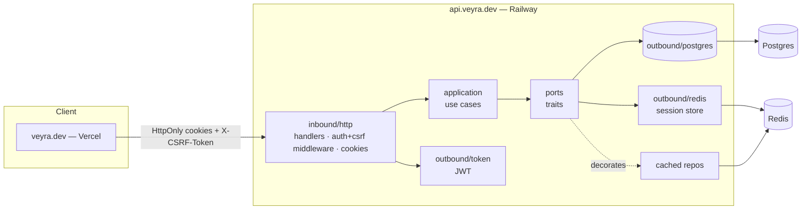

# Redis Auth (Access + Refresh + Cookies) & Caching — Implementation Plan

> **For agentic workers:** REQUIRED SUB-SKILL: Use superpowers:subagent-driven-development (recommended) or superpowers:executing-plans to implement this plan task-by-task. Steps use checkbox (`- [ ]`) syntax for tracking.

**Goal:** Replace the single long-lived JWT with short-lived access + rotating refresh tokens delivered as HttpOnly cookies, backed by a Redis session store, with session-id revocation, double-submit CSRF, and a transparent read cache.

**Architecture:** Hexagonal DDD single crate. New ports (`SessionStore`, extended `AuthPort`) stay domain-only; Redis lives entirely in `adapters/outbound/redis/` and a relocated `adapters/outbound/token/`. Caching is a transparent repository decorator in the adapter layer (no cache port — keeps `serde` out of `ports/`). Cookie policy is environment-configurable so the same binary serves self-host (SameSite=Strict, `__Host-`) and the prod subdomain split (SameSite=Lax, `Domain`, `__Secure-`).

**Tech Stack:** Rust 2021, axum 0.8, sqlx 0.8 (PostgreSQL), `fred` 10 (Redis, feature `i-scripts`), `axum-extra` 0.10 (feature `cookie`), `sha2`, `rand`, `jsonwebtoken` 9, `argon2`. Tests: `testcontainers-modules` (features `postgres`, `redis`) + `axum-test`.

**Spec:** `docs/superpowers/specs/2026-06-27-redis-auth-cache-design.md` · **ADR:** `docs/adr/0006-refresh-tokens-redis-sessions-cache.md`

## Global Constraints

- **Hexagonal boundaries (CI-enforced, `.github/scripts/check-boundaries.sh`):** `domain/` may import only stdlib/`thiserror`/`uuid`/`chrono`/`rust_decimal` — never `axum`/`sqlx`/`serde`/`tokio`. `application/` may import `domain`+`ports` — never `axum`/`sqlx`. `ports/` may import `domain` only — never `axum`/`sqlx`/`serde`. Redis/cookie code lives in `adapters/`. **`serde` must NOT appear in `ports/`** — the cache abstraction is adapter-internal for this reason.
- **No `CachePort` in `ports/`.** Caching is transparent via decorators in `adapters/outbound/redis/`.
- **Token model:** access JWT HS256 `{ sub, sid, jti, iat, exp }` ~15 min; refresh opaque `{family_id}.{raw_secret}` ~7 days, Redis stores **SHA-256 hash** of `raw_secret` (never raw); CSRF random, readable cookie, double-submit on all mutating protected routes.
- **Fail modes:** read path (access revocation check) fails **open**; write path (logout, refresh) fails **closed**.
- **`sid` revocation:** one `revoke:{sid}` key invalidates all access tokens of a session. No per-`jti` denylist.
- **Cookie prefix derived from config:** `COOKIE_DOMAIN` unset + `COOKIE_SECURE=true` → `__Host-`; `COOKIE_DOMAIN` set → `__Secure-`; `COOKIE_SECURE=false` → no prefix. Refresh cookie is always `Path=/auth` → never `__Host-` (uses `__Secure-`/none).
- **CORS:** explicit allowlist + `Allow-Credentials: true`. Never wildcard `"*"` (project rule; also illegal with credentials).
- **No `println!`** in production code — `tracing::{debug,info,warn,error}!`.

### Rust quality gate — write compliant from the first commit (NO Sonar; clippy is the gate)

```
- clippy::too_many_arguments — ≤7 params (aim ≤5); past that, a params struct / builder.
- clippy::cognitive_complexity — extract named helpers; early-return `?`; flatten with `let ... else`.
- NO `.unwrap()` / `.expect()` / `panic!` / `todo!()` on production paths — return `Result` + `?` /
  `ok_or_else` / `unwrap_or_default`. (Tests MAY unwrap/expect freely.)
- Duplicated string literal ≥3× → a module-level `const` (Redis key prefixes, cookie names, error strings).
- `#![forbid(unsafe_code)]` crate-wide.
- Errors: thiserror enums in domain/ports/application; map at the existing single ApiError IntoResponse point.
  Never `let _ = fallible();` (swallowed Result) — handle or `?`.
- Async: never hold a std::sync::Mutex across `.await`; never block the runtime; bound fan-out.
- Redis (fred): all keys via module consts; Lua for compare-and-swap (atomicity); never format untrusted into Lua.
- Verify before "done": cargo fmt --check → cargo clippy --all-targets --all-features -- -D warnings →
  cargo nextest run → cargo audit.
```

When fixing one instance of a rule, scan sibling files for the same shape and fix-forward.

### Existing interfaces (read before starting)

- `AuthPort` (`src/ports/auth.rs`): `sign_token(user_id) -> Result<String, AuthError>`, `verify_token(&str) -> Result<Uuid, AuthError>`; `AuthError::{InvalidToken, SigningFailed(String)}`.
- `AppState` (`src/bootstrap/state.rs`): `new(pool: PgPool, jwt_secret: String)`; fields `pool`, `*_repo: Arc<dyn …>`, `auth: Arc<dyn AuthPort>`.
- `Config` (`src/bootstrap/config.rs`): `{ database_url, jwt_secret, port }`, `load() -> Result<Self>` (figment `Env::raw()` + `JWT_SECRET ≥ 32` guard).
- `VehicleRepository` (`src/ports/repositories.rs`): `list_by_user(uid) `, `find_by_id(id, uid)`, `insert(CreateVehicleParams)`, `update(id, uid, UpdateVehicleParams)`, `delete(id, uid)`.
- `SummaryRepository`: `get_summary(vehicle_id, user_id) -> RepositoryResult<Summary>`.
- Test helper `spawn_app()` (`tests/common/mod.rs`) builds Postgres testcontainer + `AppState` + `axum-test` `TestServer`. `register_and_login(app, email) -> String` (currently returns bearer token).

---

## Task 1: Dependencies, config, Redis pool, compose

**Files:**
- Modify: `apps/backend/Cargo.toml`
- Modify: `apps/backend/src/bootstrap/config.rs`
- Create: `apps/backend/src/adapters/outbound/redis/mod.rs`
- Create: `apps/backend/src/adapters/outbound/redis/client.rs`
- Modify: `apps/backend/src/adapters/outbound/mod.rs` (add `pub mod redis;`)
- Modify: `apps/backend/.env.example`
- Modify: `docker-compose.yml`
- Test: unit tests inside `config.rs`

**Interfaces — Produces:**
- `Config` gains: `redis_url: String`, `access_ttl_secs: u64` (900), `refresh_ttl_secs: u64` (604800), `refresh_grace_secs: u64` (10), `cookie_secure: bool` (true), `cookie_samesite: SameSiteCfg` (`Strict|Lax|None`, default `Strict`), `cookie_domain: Option<String>`.
- `redis::client::build_pool(redis_url: &str) -> anyhow::Result<fred::clients::Pool>`.

**TDD: yes** — config defaults + `SameSiteCfg` parse + `REDIS_URL`-required validation have a clear input→output contract. Big O: n/a.

- [ ] **Step 1: Add dependencies.** In `apps/backend/Cargo.toml` `[dependencies]` add:
```toml
fred = { version = "10", features = ["i-scripts"] }
axum-extra = { version = "0.10", features = ["cookie"] }
sha2 = "0.10"
rand = "0.8"
hex = "0.4"
base64 = "0.22"
```
and in `[dev-dependencies]` change the testcontainers line to:
```toml
testcontainers-modules = { version = "0.15", features = ["postgres", "redis"] }
```
Run `cargo build` to fetch. (If a pinned patch fails to resolve, run `cargo add fred --features i-scripts` etc. and keep the resolved version.)

- [ ] **Step 2: Write failing config tests.** Append to `src/bootstrap/config.rs`:
```rust
#[cfg(test)]
mod tests {
    use super::*;

    #[test]
    fn samesite_parses_case_insensitive() {
        assert_eq!("strict".parse::<SameSiteCfg>().unwrap(), SameSiteCfg::Strict);
        assert_eq!("LAX".parse::<SameSiteCfg>().unwrap(), SameSiteCfg::Lax);
        assert_eq!("None".parse::<SameSiteCfg>().unwrap(), SameSiteCfg::None);
        assert!("bogus".parse::<SameSiteCfg>().is_err());
    }
}
```
Run: `cargo test --lib bootstrap::config -v` → FAIL (`SameSiteCfg` not defined).

- [ ] **Step 3: Implement config additions.** Replace `src/bootstrap/config.rs` body:
```rust
use anyhow::Result;
use figment::{providers::Env, Figment};
use serde::Deserialize;
use std::str::FromStr;

#[derive(Debug, Deserialize, Clone)]
pub struct Config {
    pub database_url: String,
    pub redis_url: String,
    pub jwt_secret: String,
    #[serde(default = "default_port")]
    pub port: u16,
    #[serde(default = "default_access_ttl")]
    pub access_ttl_secs: u64,
    #[serde(default = "default_refresh_ttl")]
    pub refresh_ttl_secs: u64,
    #[serde(default = "default_refresh_grace")]
    pub refresh_grace_secs: u64,
    #[serde(default = "default_cookie_secure")]
    pub cookie_secure: bool,
    #[serde(default)]
    pub cookie_samesite: SameSiteCfg,
    #[serde(default)]
    pub cookie_domain: Option<String>,
}

#[derive(Debug, Clone, Copy, PartialEq, Eq, Deserialize, Default)]
#[serde(rename_all = "lowercase")]
pub enum SameSiteCfg {
    #[default]
    Strict,
    Lax,
    None,
}

impl FromStr for SameSiteCfg {
    type Err = String;
    fn from_str(s: &str) -> Result<Self, Self::Err> {
        match s.to_ascii_lowercase().as_str() {
            "strict" => Ok(Self::Strict),
            "lax" => Ok(Self::Lax),
            "none" => Ok(Self::None),
            other => Err(format!("invalid COOKIE_SAMESITE: {other}")),
        }
    }
}

fn default_port() -> u16 { 3000 }
fn default_access_ttl() -> u64 { 900 }
fn default_refresh_ttl() -> u64 { 604_800 }
fn default_refresh_grace() -> u64 { 10 }
fn default_cookie_secure() -> bool { true }

impl Config {
    pub fn load() -> Result<Self> {
        dotenvy::dotenv().ok();
        let config: Self = Figment::new().merge(Env::raw()).extract()?;
        anyhow::ensure!(
            config.jwt_secret.len() >= 32,
            "JWT_SECRET must be at least 32 bytes (got {})",
            config.jwt_secret.len()
        );
        anyhow::ensure!(!config.redis_url.is_empty(), "REDIS_URL must be set");
        Ok(config)
    }
}
```
Run: `cargo test --lib bootstrap::config -v` → PASS.

- [ ] **Step 4: Implement Redis pool builder.** `src/adapters/outbound/redis/mod.rs`:
```rust
pub mod client;
```
`src/adapters/outbound/redis/client.rs`:
```rust
use anyhow::Context;
use fred::clients::Pool;
use fred::prelude::*;

/// Builds and initializes a fred connection pool from a `redis://` URL.
/// The returned pool is cheap to clone and shared across the app via `AppState`.
pub async fn build_pool(redis_url: &str) -> anyhow::Result<Pool> {
    let config = Config::from_url(redis_url).context("invalid REDIS_URL")?;
    let pool = Builder::from_config(config)
        .build_pool(8)
        .context("failed to build Redis pool")?;
    pool.init().await.context("failed to connect to Redis")?;
    Ok(pool)
}
```
Add `pub mod redis;` to `src/adapters/outbound/mod.rs`. Run: `cargo build` → OK.

- [ ] **Step 5: Update `.env.example` and compose.** Append to `apps/backend/.env.example`:
```
REDIS_URL=redis://localhost:6379
ACCESS_TTL_SECS=900
REFRESH_TTL_SECS=604800
REFRESH_GRACE_SECS=10
COOKIE_SECURE=false
COOKIE_SAMESITE=strict
# COOKIE_DOMAIN=veyra.dev   # set in prod subdomain split only
```
In `docker-compose.yml` add a `redis` service and wire it into `backend`:
```yaml
  redis:
    image: redis:7-alpine
    command: ["redis-server", "--appendonly", "yes"]
    volumes:
      - redis_data:/data
    healthcheck:
      test: ["CMD", "redis-cli", "ping"]
      interval: 5s
      timeout: 5s
      retries: 5
```
Under `backend.environment` add `REDIS_URL: redis://redis:6379`; under `backend.depends_on` add `redis: { condition: service_healthy }`. Add `redis_data:` under `volumes:`. (No published `ports:` for redis — internal network only.)

- [ ] **Step 6: Commit.**
```bash
git add apps/backend/Cargo.toml apps/backend/Cargo.lock apps/backend/src/bootstrap/config.rs apps/backend/src/adapters/outbound/redis apps/backend/src/adapters/outbound/mod.rs apps/backend/.env.example docker-compose.yml
git commit -m "feat(redis): add fred pool, cookie/ttl config, compose redis service"
```

---

## Task 2: Extend AuthPort (access claims with sid+jti); move JwtAuth to token/

**Files:**
- Modify: `apps/backend/src/ports/auth.rs`
- Create: `apps/backend/src/adapters/outbound/token/mod.rs`
- Create: `apps/backend/src/adapters/outbound/token/jwt_auth.rs` (moved + extended from `postgres/jwt_auth.rs`)
- Delete: `apps/backend/src/adapters/outbound/postgres/jwt_auth.rs`
- Modify: `apps/backend/src/adapters/outbound/postgres/mod.rs` (remove `pub mod jwt_auth;`)
- Modify: `apps/backend/src/adapters/outbound/mod.rs` (add `pub mod token;`)
- Modify: `apps/backend/src/bootstrap/state.rs` (import path `token::jwt_auth::JwtAuth`)
- Test: unit tests inside `token/jwt_auth.rs`

**Interfaces — Produces:**
- `ports::auth::AccessClaims { user_id: Uuid, sid: Uuid, jti: Uuid }`
- `AuthPort::sign_access(&self, user_id: Uuid, sid: Uuid, jti: Uuid) -> Result<String, AuthError>`
- `AuthPort::verify_access(&self, token: &str) -> Result<AccessClaims, AuthError>`
- `JwtAuth::new(secret: String, access_ttl_secs: u64) -> Self`

**TDD: yes** — sign/verify roundtrip must preserve `sub`/`sid`/`jti`; expired/wrong-secret must reject. Big O: n/a.

- [ ] **Step 1: Replace `AuthPort`.** `src/ports/auth.rs`:
```rust
use uuid::Uuid;

#[derive(Debug, thiserror::Error)]
pub enum AuthError {
    #[error("invalid or expired token")]
    InvalidToken,
    #[error("token generation failed: {0}")]
    SigningFailed(String),
}

#[derive(Debug, Clone, PartialEq, Eq)]
pub struct AccessClaims {
    pub user_id: Uuid,
    pub sid: Uuid,
    pub jti: Uuid,
}

pub trait AuthPort: Send + Sync {
    fn sign_access(&self, user_id: Uuid, sid: Uuid, jti: Uuid) -> Result<String, AuthError>;
    fn verify_access(&self, token: &str) -> Result<AccessClaims, AuthError>;
}
```

- [ ] **Step 2: Write failing tests in new location.** Create `src/adapters/outbound/token/mod.rs` with `pub mod jwt_auth;`, and `src/adapters/outbound/token/jwt_auth.rs` with the test module:
```rust
#[cfg(test)]
mod tests {
    use super::*;
    use uuid::Uuid;

    #[test]
    fn sign_and_verify_preserves_claims() {
        let jwt = JwtAuth::new("test-secret-32chars-at-minimum!!".into(), 900);
        let (uid, sid, jti) = (Uuid::new_v4(), Uuid::new_v4(), Uuid::new_v4());
        let token = jwt.sign_access(uid, sid, jti).unwrap();
        let claims = jwt.verify_access(&token).unwrap();
        assert_eq!(claims.user_id, uid);
        assert_eq!(claims.sid, sid);
        assert_eq!(claims.jti, jti);
    }

    #[test]
    fn verify_rejects_wrong_secret() {
        let a = JwtAuth::new("secret-a-32chars-at-minimum--!!".into(), 900);
        let b = JwtAuth::new("secret-b-32chars-at-minimum--!!".into(), 900);
        let token = a.sign_access(Uuid::new_v4(), Uuid::new_v4(), Uuid::new_v4()).unwrap();
        assert!(matches!(b.verify_access(&token), Err(AuthError::InvalidToken)));
    }

    #[test]
    fn verify_rejects_expired() {
        let jwt = JwtAuth::new("test-secret-32chars-at-minimum!!".into(), 0); // exp = now
        let token = jwt.sign_access(Uuid::new_v4(), Uuid::new_v4(), Uuid::new_v4()).unwrap();
        std::thread::sleep(std::time::Duration::from_secs(1));
        assert!(matches!(jwt.verify_access(&token), Err(AuthError::InvalidToken)));
    }
}
```
Add `pub mod token;` to `src/adapters/outbound/mod.rs`. Run: `cargo test --lib token::jwt_auth -v` → FAIL (no `JwtAuth`).

- [ ] **Step 3: Implement `JwtAuth`.** Prepend to `src/adapters/outbound/token/jwt_auth.rs`:
```rust
use chrono::{Duration, Utc};
use jsonwebtoken::{decode, encode, Algorithm, DecodingKey, EncodingKey, Header, Validation};
use serde::{Deserialize, Serialize};
use uuid::Uuid;

use crate::ports::auth::{AccessClaims, AuthError, AuthPort};

#[derive(Debug, Serialize, Deserialize)]
struct Claims {
    sub: String,
    sid: String,
    jti: String,
    iat: i64,
    exp: i64,
}

/// HS256 access-token signer/verifier. `access_ttl_secs` controls `exp`.
#[derive(Clone)]
pub struct JwtAuth {
    secret: String,
    access_ttl_secs: u64,
}

impl JwtAuth {
    pub fn new(secret: String, access_ttl_secs: u64) -> Self {
        Self { secret, access_ttl_secs }
    }
}

impl AuthPort for JwtAuth {
    fn sign_access(&self, user_id: Uuid, sid: Uuid, jti: Uuid) -> Result<String, AuthError> {
        let now = Utc::now();
        let claims = Claims {
            sub: user_id.to_string(),
            sid: sid.to_string(),
            jti: jti.to_string(),
            iat: now.timestamp(),
            exp: (now + Duration::seconds(self.access_ttl_secs as i64)).timestamp(),
        };
        encode(&Header::default(), &claims, &EncodingKey::from_secret(self.secret.as_bytes()))
            .map_err(|e| AuthError::SigningFailed(e.to_string()))
    }

    fn verify_access(&self, token: &str) -> Result<AccessClaims, AuthError> {
        let data = decode::<Claims>(
            token,
            &DecodingKey::from_secret(self.secret.as_bytes()),
            &Validation::new(Algorithm::HS256),
        )
        .map_err(|_| AuthError::InvalidToken)?;
        Ok(AccessClaims {
            user_id: data.claims.sub.parse().map_err(|_| AuthError::InvalidToken)?,
            sid: data.claims.sid.parse().map_err(|_| AuthError::InvalidToken)?,
            jti: data.claims.jti.parse().map_err(|_| AuthError::InvalidToken)?,
        })
    }
}
```

- [ ] **Step 4: Delete old file + fix wiring.** `rm src/adapters/outbound/postgres/jwt_auth.rs`; remove `pub mod jwt_auth;` from `postgres/mod.rs`. In `state.rs` change the import to `crate::adapters::outbound::token::jwt_auth::JwtAuth` and update construction to `JwtAuth::new(jwt_secret, access_ttl_secs)` — temporarily hardcode `900`; Task 7 threads the real config. Run: `cargo test --lib token::jwt_auth -v` → PASS; `cargo build` → OK.

- [ ] **Step 5: Commit.**
```bash
git add -A apps/backend/src
git commit -m "feat(auth): access-token claims with sid+jti; move JwtAuth to token adapter"
```

---

## Task 3: SessionStore port + RedisSessionStore (atomic rotate, revoke); redis in spawn_app

**Files:**
- Create: `apps/backend/src/ports/session.rs`
- Modify: `apps/backend/src/ports/mod.rs` (add `pub mod session;`)
- Create: `apps/backend/src/adapters/outbound/redis/session_store.rs`
- Modify: `apps/backend/src/adapters/outbound/redis/mod.rs` (add `pub mod session_store;`)
- Modify: `apps/backend/tests/common/mod.rs` (start a Redis testcontainer in `spawn_app`)
- Test: `apps/backend/tests/session_store_test.rs` (integration, testcontainers Redis)

**Interfaces — Produces:**
```rust
// ports/session.rs
pub struct NewSession { pub family_id: Uuid, pub raw_secret: String }
#[derive(Debug)]
pub enum RotateOutcome {
    Rotated { user_id: Uuid, new_raw_secret: String },
    Reused,
    NotFound,
}
#[derive(Debug, thiserror::Error)]
pub enum SessionError { #[error("session store unavailable: {0}")] Unavailable(String) }
pub type SessionResult<T> = Result<T, SessionError>;

#[async_trait::async_trait]
pub trait SessionStore: Send + Sync {
    async fn create(&self, user_id: Uuid) -> SessionResult<NewSession>;
    async fn rotate(&self, family_id: Uuid, presented_secret: &str) -> SessionResult<RotateOutcome>;
    async fn revoke(&self, family_id: Uuid) -> SessionResult<()>;
    /// Writes `revoke:{sid}` with a TTL = access-token lifetime; invalidates all access tokens of the session.
    async fn revoke_session(&self, sid: Uuid, ttl_secs: u64) -> SessionResult<()>;
    async fn is_session_revoked(&self, sid: Uuid) -> SessionResult<bool>;
}
```

**TDD: yes (integration)** — the atomic rotate / grace / reuse-revoke is the security-critical core; test against a real Redis. **Big O:** all ops O(1) Redis round-trips (single key by `family_id`/`sid`); the Lua script does constant field reads/writes. State in Bahasa Indonesia in the dispatch: setiap operasi O(1) — satu key per family, gak ada scan.

- [ ] **Step 1: Create the port.** Write `src/ports/session.rs` with the block above; add `pub mod session;` to `ports/mod.rs`.

- [ ] **Step 2: Write failing integration test.** `apps/backend/tests/session_store_test.rs`:
```rust
mod common;
use common::redis_store; // helper added in Step 4
use uuid::Uuid;
use veyra::ports::session::{RotateOutcome, SessionStore};

#[tokio::test]
async fn rotate_happy_path_then_old_secret_reused() {
    let (store, _guard) = redis_store().await;
    let uid = Uuid::new_v4();
    let s = store.create(uid).await.unwrap();

    // current secret rotates
    let r1 = store.rotate(s.family_id, &s.raw_secret).await.unwrap();
    let new1 = match r1 { RotateOutcome::Rotated { new_raw_secret, user_id } => { assert_eq!(user_id, uid); new_raw_secret }, o => panic!("expected Rotated, got {o:?}") };

    // presenting the ORIGINAL secret again, AFTER it fell out of grace, is reuse → revoke
    // (grace defaults to 10s in prod; the test store is built with grace=0 — see Step 4)
    let r2 = store.rotate(s.family_id, &s.raw_secret).await.unwrap();
    assert!(matches!(r2, RotateOutcome::Reused));

    // family revoked → subsequent rotate with the latest secret is NotFound
    let r3 = store.rotate(s.family_id, &new1).await.unwrap();
    assert!(matches!(r3, RotateOutcome::NotFound));
}

#[tokio::test]
async fn in_grace_previous_secret_still_rotates() {
    let (store, _guard) = redis_store_with_grace(5).await; // helper variant, grace=5s
    let uid = Uuid::new_v4();
    let s = store.create(uid).await.unwrap();
    let new1 = match store.rotate(s.family_id, &s.raw_secret).await.unwrap() {
        RotateOutcome::Rotated { new_raw_secret, .. } => new_raw_secret, o => panic!("{o:?}"),
    };
    // immediately presenting the previous (in grace) secret → still Rotated, family NOT revoked
    let r = store.rotate(s.family_id, &s.raw_secret).await.unwrap();
    assert!(matches!(r, RotateOutcome::Rotated { .. }));
    // the just-issued new1 is now the previous; still in grace → also rotates
    assert!(matches!(store.rotate(s.family_id, &new1).await.unwrap(), RotateOutcome::Rotated { .. }));
}

#[tokio::test]
async fn revoke_then_is_revoked_true() {
    let (store, _guard) = redis_store().await;
    let sid = Uuid::new_v4();
    store.revoke(sid).await.unwrap();
    assert!(store.is_session_revoked(sid).await.unwrap());
    assert!(!store.is_session_revoked(Uuid::new_v4()).await.unwrap());
}
```
Run: `cargo nextest run --test session_store_test` → FAIL (no `redis_store`, no impl).

- [ ] **Step 3: Implement `RedisSessionStore`.** `src/adapters/outbound/redis/session_store.rs`:
```rust
use async_trait::async_trait;
use fred::clients::Pool;
use fred::prelude::*;
use rand::RngCore;
use sha2::{Digest, Sha256};
use uuid::Uuid;

use crate::ports::session::{NewSession, RotateOutcome, SessionError, SessionResult, SessionStore};

const SESSION_PREFIX: &str = "session:";
const REVOKE_PREFIX: &str = "revoke:";

/// Atomic rotate: KEYS[1]=session key, ARGV = [presented_hash, new_hash, grace_secs, refresh_ttl_secs, now].
/// Hash fields: user_id, current, prev, prev_until.
/// Returns: {status, user_id?} as a flat array. status: "ROTATED" | "REUSED" | "NOTFOUND".
const ROTATE_LUA: &str = r#"
local key = KEYS[1]
if redis.call('EXISTS', key) == 0 then return {'NOTFOUND'} end
local cur  = redis.call('HGET', key, 'current')
local prev = redis.call('HGET', key, 'prev')
local pu   = tonumber(redis.call('HGET', key, 'prev_until') or '0')
local uid  = redis.call('HGET', key, 'user_id')
local presented = ARGV[1]
local now = tonumber(ARGV[5])
local in_grace_prev = (prev ~= false and prev == presented and now < pu)
if presented == cur or in_grace_prev then
  redis.call('HSET', key, 'prev', cur, 'prev_until', now + tonumber(ARGV[3]), 'current', ARGV[2])
  redis.call('EXPIRE', key, tonumber(ARGV[4]))
  return {'ROTATED', uid}
end
return {'REUSED'}
"#;

#[derive(Clone)]
pub struct RedisSessionStore {
    pool: Pool,
    refresh_ttl_secs: u64,
    grace_secs: u64,
}

fn hash_secret(raw: &str) -> String {
    let mut h = Sha256::new();
    h.update(raw.as_bytes());
    hex::encode(h.finalize())
}

fn random_secret() -> String {
    let mut bytes = [0u8; 32];
    rand::thread_rng().fill_bytes(&mut bytes);
    use base64::Engine;
    base64::engine::general_purpose::URL_SAFE_NO_PAD.encode(bytes)
}

fn map_err(e: Error) -> SessionError { SessionError::Unavailable(e.to_string()) }

impl RedisSessionStore {
    pub fn new(pool: Pool, refresh_ttl_secs: u64, grace_secs: u64) -> Self {
        Self { pool, refresh_ttl_secs, grace_secs }
    }
    fn skey(family: Uuid) -> String { format!("{SESSION_PREFIX}{family}") }
    fn rkey(sid: Uuid) -> String { format!("{REVOKE_PREFIX}{sid}") }
}

#[async_trait]
impl SessionStore for RedisSessionStore {
    async fn create(&self, user_id: Uuid) -> SessionResult<NewSession> {
        let family_id = Uuid::new_v4();
        let raw_secret = random_secret();
        let key = Self::skey(family_id);
        let fields = vec![
            ("user_id", user_id.to_string()),
            ("current", hash_secret(&raw_secret)),
            ("prev", String::new()),
            ("prev_until", "0".to_string()),
        ];
        let _: () = self.pool.hset(&key, fields).await.map_err(map_err)?;
        let _: () = self.pool
            .expire(&key, self.refresh_ttl_secs as i64, None)
            .await
            .map_err(map_err)?;
        Ok(NewSession { family_id, raw_secret })
    }

    async fn rotate(&self, family_id: Uuid, presented_secret: &str) -> SessionResult<RotateOutcome> {
        let new_secret = random_secret();
        let now = chrono::Utc::now().timestamp();
        // `eval` sends the script body each call (no separate load/evalsha round-trip to manage).
        let out: Vec<String> = self.pool
            .eval(
                ROTATE_LUA,
                vec![Self::skey(family_id)],
                vec![
                    hash_secret(presented_secret),
                    hash_secret(&new_secret),
                    self.grace_secs.to_string(),
                    self.refresh_ttl_secs.to_string(),
                    now.to_string(),
                ],
            )
            .await
            .map_err(map_err)?;
        match out.first().map(String::as_str) {
            Some("ROTATED") => {
                let user_id = out.get(1).and_then(|s| s.parse().ok())
                    .ok_or_else(|| SessionError::Unavailable("missing user_id".into()))?;
                Ok(RotateOutcome::Rotated { user_id, new_raw_secret: new_secret })
            }
            Some("REUSED") => Ok(RotateOutcome::Reused),
            _ => Ok(RotateOutcome::NotFound),
        }
    }

    async fn revoke(&self, family_id: Uuid) -> SessionResult<()> {
        let _: () = self.pool.del(Self::skey(family_id)).await.map_err(map_err)?;
        Ok(())
    }

    async fn revoke_session(&self, sid: Uuid, ttl_secs: u64) -> SessionResult<()> {
        let _: () = self.pool
            .set(Self::rkey(sid), "1", Some(Expiration::EX(ttl_secs as i64)), None, false)
            .await
            .map_err(map_err)?;
        Ok(())
    }

    async fn is_session_revoked(&self, sid: Uuid) -> SessionResult<bool> {
        let exists: bool = self.pool.exists(Self::rkey(sid)).await.map_err(map_err)?;
        Ok(exists)
    }
}
```
Add `pub mod session_store;` to `redis/mod.rs` (`hex`/`base64` were added to `Cargo.toml` in Task 1).

- [ ] **Step 4: Add Redis to test harness.** In `tests/common/mod.rs` add (keeping the existing Postgres logic):
```rust
use testcontainers_modules::redis::Redis;
use veyra::adapters::outbound::redis::{client::build_pool, session_store::RedisSessionStore};

/// Returns a RedisSessionStore (grace=0 so "previous" is immediately reusable→revoke in tests)
/// plus the container guard that must stay alive for the test's duration.
pub async fn redis_store() -> (RedisSessionStore, impl Sized) { redis_store_with_grace(0).await }

pub async fn redis_store_with_grace(grace: u64) -> (RedisSessionStore, impl Sized) {
    let container = Redis::default().start().await.unwrap();
    let port = container.get_host_port_ipv4(6379).await.unwrap();
    let pool = build_pool(&format!("redis://127.0.0.1:{port}")).await.unwrap();
    (RedisSessionStore::new(pool, 604_800, grace), container)
}
```
Run: `cargo nextest run --test session_store_test` → PASS (Docker required).

- [ ] **Step 5: Commit.**
```bash
git add -A apps/backend
git commit -m "feat(session): Redis session store with atomic Lua rotation + sid revocation"
```

---

## Task 4: RefreshUseCase + LogoutUseCase (application policy)

**Files:**
- Create: `apps/backend/src/application/auth/refresh.rs`
- Create: `apps/backend/src/application/auth/logout.rs`
- Modify: `apps/backend/src/application/auth/mod.rs` (add `pub mod refresh; pub mod logout;`)
- Test: unit tests inside each file (fake `SessionStore` + fake `AuthPort`)

**Interfaces — Consumes:** `SessionStore`, `RotateOutcome`, `AuthPort` (Task 2/3). **Produces:**
```rust
pub struct RefreshOutput { pub access_token: String, pub family_id: Uuid, pub raw_secret: String }
pub enum RefreshError { Invalid, Unavailable }   // Invalid → 401; Unavailable → 503
RefreshUseCase::execute(&self, family_id: Uuid, presented_secret: &str) -> Result<RefreshOutput, RefreshError>
LogoutUseCase::execute(&self, family_id: Uuid, sid: Uuid) -> Result<(), LogoutError> // LogoutError::Unavailable → 503 (fail-closed)
```

**TDD: yes** — outcome→action mapping and fail-closed behavior are pure policy; test with fakes. Big O: O(1).

- [ ] **Step 1: Write failing tests.** In `refresh.rs` test module: a fake `SessionStore` whose `rotate` returns a configured `RotateOutcome`; assert:
  - `Rotated` → `Ok(RefreshOutput)` with a freshly signed access token and the new secret.
  - `Reused` → `Err(RefreshError::Invalid)` **and** the fake records that `revoke` + `revoke_session` were called (theft response).
  - `NotFound` → `Err(RefreshError::Invalid)`.
  - store returns `Err(SessionError::Unavailable)` → `Err(RefreshError::Unavailable)`.
  In `logout.rs` test module: `revoke` + `revoke_session` succeed → `Ok(())`; either returns `Unavailable` → `Err(LogoutError::Unavailable)` (fail-closed).
  Run: `cargo test --lib application::auth -v` → FAIL.

- [ ] **Step 2: Implement.** `refresh.rs`:
```rust
use std::sync::Arc;
use uuid::Uuid;
use crate::ports::{auth::AuthPort, session::{RotateOutcome, SessionStore}};

pub struct RefreshUseCase {
    pub sessions: Arc<dyn SessionStore>,
    pub auth: Arc<dyn AuthPort>,
    pub access_ttl_secs: u64,
}
pub struct RefreshOutput { pub access_token: String, pub family_id: Uuid, pub raw_secret: String }
#[derive(Debug)]
pub enum RefreshError { Invalid, Unavailable }

impl RefreshUseCase {
    pub async fn execute(&self, family_id: Uuid, presented_secret: &str) -> Result<RefreshOutput, RefreshError> {
        match self.sessions.rotate(family_id, presented_secret).await {
            Ok(RotateOutcome::Rotated { user_id, new_raw_secret }) => {
                let access = self.auth
                    .sign_access(user_id, family_id, Uuid::new_v4())
                    .map_err(|_| RefreshError::Unavailable)?;
                Ok(RefreshOutput { access_token: access, family_id, raw_secret: new_raw_secret })
            }
            Ok(RotateOutcome::Reused) => {
                // theft response: kill the family + block its access tokens
                let _ = self.sessions.revoke(family_id).await;
                let _ = self.sessions.revoke_session(family_id, self.access_ttl_secs).await;
                Err(RefreshError::Invalid)
            }
            Ok(RotateOutcome::NotFound) => Err(RefreshError::Invalid),
            Err(_) => Err(RefreshError::Unavailable),
        }
    }
}
```
`logout.rs`:
```rust
use std::sync::Arc;
use uuid::Uuid;
use crate::ports::session::SessionStore;

pub struct LogoutUseCase { pub sessions: Arc<dyn SessionStore>, pub access_ttl_secs: u64 }
#[derive(Debug)]
pub enum LogoutError { Unavailable }

impl LogoutUseCase {
    /// Fail-closed: a logout that cannot reach Redis returns Unavailable (caller → 503),
    /// never a silent success that leaves the session live.
    pub async fn execute(&self, family_id: Uuid, sid: Uuid) -> Result<(), LogoutError> {
        self.sessions.revoke(family_id).await.map_err(|_| LogoutError::Unavailable)?;
        self.sessions.revoke_session(sid, self.access_ttl_secs).await.map_err(|_| LogoutError::Unavailable)?;
        Ok(())
    }
}
```
Run: `cargo test --lib application::auth -v` → PASS.

- [ ] **Step 3: Commit.**
```bash
git add apps/backend/src/application/auth
git commit -m "feat(auth): refresh (rotation + theft response) and logout (fail-closed) use cases"
```

---

## Task 5: register/login create a session

**Files:**
- Modify: `apps/backend/src/application/auth/register.rs`
- Modify: `apps/backend/src/application/auth/login.rs`
- Test: update unit tests in both files

**Interfaces — Produces:** both use cases return
```rust
pub struct AuthSession { pub access_token: String, pub family_id: Uuid, pub raw_secret: String, pub sid: Uuid }
RegisterUseCase::execute(email, password, name) -> Result<AuthSession, AppError>
LoginUseCase::execute(email, password) -> Result<AuthSession, AppError>
```
(`sid == family_id`.) Both now also hold `sessions: Arc<dyn SessionStore>` and `access_ttl_secs`.

**TDD: yes** — credential/validation paths already tested; extend to assert a session is created and an access token returned. Big O: O(1).

- [ ] **Step 1: Update failing tests.** In both test modules add a fake `SessionStore` (only `create` needed; others `unimplemented!()` is fine in a test fake but per the gate use `Err(SessionError::Unavailable(...))` to avoid panics). Assert `execute` returns `AuthSession` whose `access_token == "mock.jwt.token"` (the fake `AuthPort::sign_access` returns it) and `family_id == sid`. Update the existing `MockAuth` to impl the new `AuthPort` (`sign_access`/`verify_access`). Run: `cargo test --lib application::auth -v` → FAIL.

- [ ] **Step 2: Implement.** In `login.rs`, after Argon2 verification succeeds, replace the `sign_token` tail with:
```rust
let session = self.sessions.create(user.id).await.map_err(|_| AppError::Internal("session store".into()))?;
let access = self.auth
    .sign_access(user.id, session.family_id, Uuid::new_v4())
    .map_err(|e| AppError::Internal(e.to_string()))?;
Ok(AuthSession { access_token: access, family_id: session.family_id, raw_secret: session.raw_secret, sid: session.family_id })
```
Add fields `sessions: Arc<dyn SessionStore>` and `access_ttl_secs: u64` to `LoginUseCase` (and `RegisterUseCase`). Apply the equivalent change to `register.rs` after the user insert. Define `AuthSession` in `application/auth/mod.rs` and re-export. Run: `cargo test --lib application::auth -v` → PASS.

- [ ] **Step 3: Commit.**
```bash
git add apps/backend/src/application/auth
git commit -m "feat(auth): register/login create a Redis session and return access material"
```

---

## Task 6: Cookie builder + CSRF middleware

**Files:**
- Create: `apps/backend/src/adapters/inbound/http/cookies.rs`
- Create: `apps/backend/src/adapters/inbound/http/middleware/csrf.rs`
- Modify: `apps/backend/src/adapters/inbound/http/mod.rs` (add `pub mod cookies;`)
- Modify: `apps/backend/src/adapters/inbound/http/middleware/mod.rs` (add `pub mod csrf;`)
- Test: unit tests inside `cookies.rs`

**Interfaces — Produces:**
```rust
// cookies.rs
pub struct CookiePolicy { pub secure: bool, pub samesite: SameSiteCfg, pub domain: Option<String>,
    pub access_ttl_secs: u64, pub refresh_ttl_secs: u64 }
pub fn access_cookie(policy: &CookiePolicy, value: &str) -> Cookie<'static>;
pub fn refresh_cookie(policy: &CookiePolicy, value: &str) -> Cookie<'static>; // Path=/auth
pub fn csrf_cookie(policy: &CookiePolicy, value: &str) -> Cookie<'static>;    // not HttpOnly
pub fn clear(policy: &CookiePolicy, which: CookieKind) -> Cookie<'static>;
pub const ACCESS_BASE: &str = "veyra_access";
pub const REFRESH_BASE: &str = "veyra_refresh";
pub const CSRF_BASE: &str = "veyra_csrf";
pub fn access_name(policy) -> String; // applies __Host-/__Secure-/none prefix
pub fn refresh_name(policy) -> String; // never __Host- (Path=/auth) → __Secure-/none
pub fn csrf_name(policy) -> String;
```

**TDD: yes** — prefix derivation + attribute matrix is pure logic with exact expected outputs. Big O: n/a.

- [ ] **Step 1: Write failing tests.** In `cookies.rs`:
```rust
#[cfg(test)]
mod tests {
    use super::*;
    use crate::bootstrap::config::SameSiteCfg;

    fn policy(secure: bool, domain: Option<&str>) -> CookiePolicy {
        CookiePolicy { secure, samesite: SameSiteCfg::Strict, domain: domain.map(String::from),
            access_ttl_secs: 900, refresh_ttl_secs: 604_800 }
    }

    #[test]
    fn host_prefix_when_secure_and_no_domain() {
        let p = policy(true, None);
        assert_eq!(access_name(&p), "__Host-veyra_access");
        assert_eq!(refresh_name(&p), "__Secure-veyra_refresh"); // Path=/auth forbids __Host-
    }
    #[test]
    fn secure_prefix_when_domain_set() {
        let p = policy(true, Some("veyra.dev"));
        assert_eq!(access_name(&p), "__Secure-veyra_access");
    }
    #[test]
    fn no_prefix_when_insecure_dev() {
        let p = policy(false, None);
        assert_eq!(access_name(&p), "veyra_access");
    }
    #[test]
    fn refresh_cookie_is_scoped_to_auth_path() {
        let c = refresh_cookie(&policy(true, None), "fam.secret");
        assert_eq!(c.path(), Some("/auth"));
        assert!(c.http_only().unwrap());
    }
    #[test]
    fn csrf_cookie_is_readable() {
        let c = csrf_cookie(&policy(true, None), "tok");
        assert_ne!(c.http_only(), Some(true)); // JS must read it
    }
}
```
Run: `cargo test --lib http::cookies -v` → FAIL.

- [ ] **Step 2: Implement `cookies.rs`.** Use `axum_extra::extract::cookie::{Cookie, SameSite}` and `cookie::time::Duration`. Map `SameSiteCfg` → `SameSite`. Prefix rule: `secure && domain.is_none()` → `__Host-` (access/csrf) but refresh always `__Secure-`; `domain.is_some() && secure` → `__Secure-`; `!secure` → no prefix. Each builder sets `http_only` (access/refresh true, csrf false), `secure`, `same_site`, `path` (`/` for access/csrf, `/auth` for refresh), `max_age` from the matching TTL, and `domain` if set (NOT for `__Host-`). `clear(...)` returns a cookie with the same name/path/domain and `max_age(Duration::ZERO)`. Run: `cargo test --lib http::cookies -v` → PASS.

- [ ] **Step 3: Implement CSRF middleware.** `middleware/csrf.rs`:
```rust
use axum::{extract::{Request, State}, http::{Method, StatusCode}, middleware::Next, response::Response};
use axum_extra::extract::CookieJar;
use crate::adapters::inbound::http::cookies::csrf_name;
use crate::bootstrap::state::AppState;

const CSRF_HEADER: &str = "x-csrf-token";

/// Double-submit CSRF guard for mutating methods. Compares the `X-CSRF-Token`
/// header to the csrf cookie. Read methods pass through untouched.
pub async fn require_csrf(State(state): State<AppState>, req: Request, next: Next) -> Result<Response, StatusCode> {
    if matches!(req.method(), &Method::GET | &Method::HEAD | &Method::OPTIONS) {
        return Ok(next.run(req).await);
    }
    let jar = CookieJar::from_headers(req.headers());
    let cookie_val = jar.get(&csrf_name(&state.cookie_policy)).map(|c| c.value().to_string());
    let header_val = req.headers().get(CSRF_HEADER).and_then(|v| v.to_str().ok()).map(str::to_string);
    match (cookie_val, header_val) {
        (Some(c), Some(h)) if !c.is_empty() && c == h => Ok(next.run(req).await),
        _ => Err(StatusCode::FORBIDDEN),
    }
}
```
(`state.cookie_policy: CookiePolicy` is added to `AppState` in Task 7.) Add module decls. Run: `cargo build` → expect it to fail only on the not-yet-added `state.cookie_policy`; that lands in Task 7, so build at the end of Task 7. For now `cargo build -p veyra --lib 2>&1 | head` to confirm `cookies.rs` itself compiles (comment the `csrf.rs` body's `state.cookie_policy` reference temporarily is NOT allowed — instead land Task 6's commit with `csrf.rs` and accept that the crate builds only after Task 7 wires `cookie_policy`). **Sequencing note:** commit Task 6 even though the crate does not fully build yet; Task 7 completes the wiring. The reviewer reviews Tasks 6+7 together if needed.

- [ ] **Step 4: Commit.**
```bash
git add apps/backend/src/adapters/inbound/http/cookies.rs apps/backend/src/adapters/inbound/http/middleware/csrf.rs apps/backend/src/adapters/inbound/http/mod.rs apps/backend/src/adapters/inbound/http/middleware/mod.rs
git commit -m "feat(http): env-driven cookie builder (prefix derivation) + double-submit CSRF middleware"
```

> **Controller note:** Tasks 6 and 7 form one buildable unit (Task 6 references `state.cookie_policy` that Task 7 adds). Dispatch them back-to-back; run the build/clippy gate at the end of Task 7.

---

## Task 7: Cookie auth middleware + handlers (register/login/refresh/logout) + router + wiring + migrate tests

**Files:**
- Modify: `apps/backend/src/adapters/inbound/http/middleware/auth.rs`
- Modify: `apps/backend/src/adapters/inbound/http/handlers/auth.rs`
- Modify: `apps/backend/src/adapters/inbound/http/router.rs`
- Modify: `apps/backend/src/bootstrap/state.rs` (add `sessions`, `cookie_policy`, thread `config`)
- Modify: `apps/backend/src/bootstrap/config.rs` (no change if Task 1 complete)
- Modify: `apps/backend/src/main.rs` (build redis pool, pass config to `AppState::new`)
- Modify: `apps/backend/tests/common/mod.rs` (`spawn_app` wires sessions + cookie jar + csrf helper)
- Modify: ALL existing integration tests under `apps/backend/tests/` (cookie-based auth)
- Test: `apps/backend/tests/auth_test.rs` (extend: refresh, logout, csrf)

**Interfaces — Consumes:** Tasks 2–6. **Produces:** `AppState { …, sessions: Arc<dyn SessionStore>, cookie_policy: CookiePolicy }`; `AppState::new(pool, redis_pool, config: &Config)`.

**TDD: integration** (the cookie/refresh/logout/csrf flow is end-to-end; unit-level pieces already covered in Tasks 2–6). Big O: middleware does O(1) verify + one O(1) Redis `EXISTS`.

- [ ] **Step 1: Rewrite `require_auth` (cookie + sid revocation, fail-open).**
```rust
use axum::{extract::{Request, State}, http::StatusCode, middleware::Next, response::Response};
use axum_extra::extract::CookieJar;
use crate::adapters::inbound::http::cookies::access_name;
use crate::bootstrap::state::AppState;

pub async fn require_auth(State(state): State<AppState>, mut req: Request, next: Next) -> Result<Response, StatusCode> {
    let jar = CookieJar::from_headers(req.headers());
    let token = jar.get(&access_name(&state.cookie_policy)).map(|c| c.value().to_string())
        .ok_or(StatusCode::UNAUTHORIZED)?;
    let claims = state.auth.verify_access(&token).map_err(|_| StatusCode::UNAUTHORIZED)?;

    // sid revocation check — FAIL-OPEN: a Redis outage must not lock everyone out.
    match state.sessions.is_session_revoked(claims.sid).await {
        Ok(true) => return Err(StatusCode::UNAUTHORIZED),
        Ok(false) => {}
        Err(e) => tracing::warn!(error = %e, "revocation check skipped (Redis unavailable) — failing open"),
    }
    req.extensions_mut().insert(claims.user_id);
    Ok(next.run(req).await)
}
```

- [ ] **Step 2: Handlers.** In `handlers/auth.rs`:
  - `register`/`login`: call the use case → `AuthSession`; build a `CookieJar` with `access_cookie`, `refresh_cookie` (`{family_id}.{raw_secret}`), `csrf_cookie` (fresh random via `rand`), return `(StatusCode, CookieJar, Json(UserResponse))`. **No token in the body.** The csrf value is generated here (a 32-byte base64url) and set as the readable cookie.
  - `refresh` (new): read refresh cookie via `CookieJar`, split `family_id.secret`; `RefreshUseCase::execute` → `Ok` sets new access+refresh+csrf cookies (200); `Err(Invalid)` → clear cookies + 401; `Err(Unavailable)` → 503.
  - `logout` (new): read access cookie → `verify_access` for `sid`; read refresh cookie for `family_id`; `LogoutUseCase::execute(family_id, sid)` → `Ok` clear all cookies + 204; `Err(Unavailable)` → 503 (cookies NOT cleared — logout is fail-closed).
  - `me`: unchanged.
  Generate the CSRF token with a shared helper `fn new_csrf() -> String` (reuse the `random_secret` style; put a `pub fn random_token() -> String` in `cookies.rs` to avoid duplication).

- [ ] **Step 3: Router.** Add `.route("/auth/refresh", post(auth_handlers::refresh))` and `.route("/auth/logout", post(auth_handlers::logout))` to the public group (they manage their own cookies). Apply the CSRF layer to the **protected** router: `.layer(middleware::from_fn_with_state(state.clone(), require_csrf))` (added below `require_auth` so auth runs first). Keep `register`/`login`/`refresh` CSRF-exempt (they are on the public router).

- [ ] **Step 4: AppState + main wiring.** `AppState::new(pool, redis_pool: fred::clients::Pool, config: &Config)` constructs `RedisSessionStore::new(redis_pool, config.refresh_ttl_secs, config.refresh_grace_secs)`, `JwtAuth::new(config.jwt_secret.clone(), config.access_ttl_secs)`, and `cookie_policy` from config. `main.rs`: `let redis_pool = redis::client::build_pool(&config.redis_url).await?; let state = AppState::new(pool, redis_pool, &config);`.

- [ ] **Step 5: Migrate test harness + tests.** In `tests/common/mod.rs`: `spawn_app` starts BOTH Postgres and Redis containers, builds the redis pool, calls `AppState::new(pool, redis_pool, &test_config)`; set `TestServer::builder().save_cookies().build()` so cookies persist. Rewrite `register_and_login(app, email)` to register+login (cookies now stored in the jar) and return the **csrf token** string (read from the response csrf cookie) for use as the `X-CSRF-Token` header. Add helper `fn csrf(token: &str) -> (HeaderName, HeaderValue)`. Update every mutating request in all integration test files to send the csrf header. Run: `cargo nextest run` → PASS (all suites).

- [ ] **Step 6: Extend `auth_test.rs`.** Add tests: refresh rotates and the old refresh cookie no longer works after grace; logout → `/me` returns 401 (sid revoked); a POST without `X-CSRF-Token` → 403. Run: `cargo nextest run --test auth_test` → PASS.

- [ ] **Step 7: Full gate + commit.**
```bash
cargo fmt && cargo clippy --all-targets --all-features -- -D warnings && cargo nextest run
git add -A apps/backend
git commit -m "feat(auth): cookie-based access/refresh auth, refresh+logout endpoints, CSRF layer; migrate tests"
```

---

## Task 8: RedisCache + CachedVehicleRepo decorator

**Files:**
- Create: `apps/backend/src/adapters/outbound/redis/cache.rs`
- Create: `apps/backend/src/adapters/outbound/redis/cached_vehicle_repo.rs`
- Modify: `apps/backend/src/adapters/outbound/redis/mod.rs`
- Modify: `apps/backend/src/bootstrap/state.rs` (wrap `vehicle_repo`)
- Test: `apps/backend/tests/vehicle_cache_test.rs` (integration)

**Interfaces — Produces:**
- `RedisCache::new(pool)`; adapter-internal `get_json<T: DeserializeOwned>`, `set_json<T: Serialize>(key, &T, ttl)`, `incr(key) -> u64`, `get_u64(key)`. **Not a port** — used only by decorators.
- `CachedVehicleRepo { inner: Arc<dyn VehicleRepository>, cache: RedisCache }` implements `VehicleRepository`.

**TDD: integration.** **Big O:** cache hit avoids the SQL round-trip; keys are O(1) by `user_id`(+`vehicle_id`); version bump is one `INCR`. Bahasa Indonesia in dispatch: read O(1) cache lookup; miss → O(1) PG by index; write → O(1) INCR invalidasi seluruh read-key user tanpa scan.

- [ ] **Step 1: Failing integration test** (`vehicle_cache_test.rs`): create user+vehicle; `GET /vehicles` twice → second served from cache (assert correctness, not latency — verify by mutating Postgres directly is out of scope; instead assert a second list after an *uncached* create reflects the new vehicle, proving version invalidation). Concretely:
  - list → 1 vehicle; create a 2nd vehicle (write bumps version); list → 2 vehicles (no stale 1-vehicle cache). 
  - cross-user: user B's `GET /vehicles` never returns user A's vehicles even after A populated the cache.
  Run: `cargo nextest run --test vehicle_cache_test` → FAIL.

- [ ] **Step 2: Implement `RedisCache`** (serde JSON via `serde_json`; fail-open — every method returns `Option`/falls back, never errors the caller):
```rust
const VER_PREFIX: &str = "cache:ver:";
const VEH_LIST: &str = "vehicles";
const VEH_ONE: &str = "vehicle";
// key: cache:v{ver}:vehicles:{user}  /  cache:v{ver}:vehicle:{user}:{id}
```
`get_json` returns `None` on miss OR any Redis error (logged at debug). `set_json` ignores errors. `bump_version(user_id)` does `INCR cache:ver:{user}` and returns the new value; `version(user_id)` reads it (absent → 0).

- [ ] **Step 3: Implement `CachedVehicleRepo`.** Define a private `#[derive(Serialize, Deserialize)] struct VehicleCacheModel` mirroring `Vehicle`'s fields (and `From<Vehicle>` / `Into<Vehicle>` — value objects via their string/int reprs). `list_by_user`: read version → key `cache:v{ver}:vehicles:{user}` → hit returns mapped vehicles; miss → `inner.list_by_user` → `set_json` → return. `find_by_id`: key `cache:v{ver}:vehicle:{user}:{id}`. `insert`/`update`/`delete`: call `inner` first, then on success `cache.bump_version(user_id)` (invalidates all of that user's list+detail keys). Map domain↔model inside this file only (boundary-safe; domain stays serde-free).

- [ ] **Step 4: Wire.** In `state.rs`: `let vehicle_repo: Arc<dyn VehicleRepository> = Arc::new(CachedVehicleRepo::new(Arc::new(PgVehicleRepo::new(pool.clone())), RedisCache::new(redis_pool.clone())));`. Run: `cargo nextest run --test vehicle_cache_test` → PASS; full `cargo nextest run` → PASS.

- [ ] **Step 5: Commit.**
```bash
git add -A apps/backend
git commit -m "feat(cache): transparent CachedVehicleRepo decorator with per-user version invalidation"
```

---

## Task 9: CachedSummaryRepo (TTL 60s)

**Files:**
- Create: `apps/backend/src/adapters/outbound/redis/cached_summary_repo.rs`
- Modify: `apps/backend/src/adapters/outbound/redis/mod.rs`, `src/bootstrap/state.rs`
- Test: `apps/backend/tests/summary_cache_test.rs`

**Interfaces — Produces:** `CachedSummaryRepo { inner: Arc<dyn SummaryRepository>, cache: RedisCache }` impl `SummaryRepository`. Key `cache:summary:{user_id}:{vehicle_id}`, TTL 60s, no invalidation (TTL-only, ≤60s staleness accepted per spec).

**TDD: integration.** Big O: O(1).

- [ ] **Step 1: Failing test** (`summary_cache_test.rs`): summary for a vehicle returns correct aggregates; a second call within TTL returns the same value (served from cache). Cross-user isolation: user B cannot read user A's summary key. Run → FAIL.
- [ ] **Step 2: Implement** decorator with a private `SummaryCacheModel` serde mirror; `get_summary` reads `cache:summary:{user}:{vehicle}` → hit returns mapped; miss → `inner.get_summary` → `set_json(key, &model, 60)` → return. Errors fail-open to `inner`.
- [ ] **Step 3: Wire** `summary_repo` in `state.rs` (wrap `PgSummaryRepo`). Run tests → PASS; full suite → PASS.
- [ ] **Step 4: Commit.** `git commit -m "feat(cache): CachedSummaryRepo with 60s TTL"`

---

## Task 10: Deploy config (railway.toml) + README rewrite + architecture diagram

**Files:**
- Create: `railway.toml` (repo root)
- Modify: `README.md`
- Test: none (docs/ops); run the full gate as the deliverable check.

**TDD: not applicable** (docs/config). Verify-by: `cargo fmt --check && cargo clippy --all-targets --all-features -- -D warnings && cargo nextest run && cargo audit` all green; README renders.

- [ ] **Step 1: `railway.toml`** at repo root:
```toml
[build]
builder = "dockerfile"
dockerfilePath = "apps/backend/Dockerfile"

[deploy]
healthcheckPath = "/health"
restartPolicyType = "on_failure"
```
(Document: set the Railway service Root Directory to repo root; attach managed Postgres + Redis, which inject `DATABASE_URL` / `REDIS_URL`; set `COOKIE_DOMAIN=veyra.dev`, `COOKIE_SAMESITE=lax`, `COOKIE_SECURE=true`, the CORS allowlist origin, and `JWT_SECRET`.)

- [ ] **Step 2: README rewrite.** Remove ALL emoji from `README.md`; replace section markers with text/Unicode icon glyphs only where a marker adds clarity (e.g. `›`, `—`, `▸`), not decorative emoji. Add/refresh sections: Stack (add Redis, fred, axum-extra); Auth (access+refresh cookies, CSRF, logout/refresh endpoints, the env matrix table for self-host vs prod); Configuration (full env var table from Task 1 + cookie vars); Local dev (`docker compose up` now includes Redis); Deployment (Railway backend via `railway.toml` + managed Postgres/Redis; future Vercel FE under `veyra.dev`; CORS allowlist; cookie domain). Keep copy in clear professional English (this is a disk artifact).

- [ ] **Step 3: Architecture diagram.** Add a Mermaid diagram to `README.md` showing the hexagonal layers (domain ← application ← ports ← adapters: inbound HTTP / outbound Postgres / outbound Redis-token-cache / bootstrap) and the request/auth/cache flow, plus the deploy topology (Vercel `veyra.dev` → Railway `api.veyra.dev` → managed Postgres + Redis). Verify it renders (GitHub Mermaid). Example skeleton:


- [ ] **Step 4: Final gate + commit.**
```bash
cargo fmt --check && cargo clippy --all-targets --all-features -- -D warnings && cargo nextest run && cargo audit
git add railway.toml README.md
git commit -m "docs: railway deploy config, README rewrite (icons, no emoji), architecture diagram"
```

---

## Notes for the executor

- **Docker required** for every integration suite (Postgres + Redis testcontainers). If Docker Desktop was just started, the first container creation can lag — retry rather than assume breakage.
- **`cargo audit`:** the existing `apps/backend/.cargo/audit.toml` ignores `RUSTSEC-2023-0071` (sqlx-mysql not compiled). Adding `fred`/`base64`/`hex` may surface new advisories — investigate; only ignore with a documented justification.
- **Boundary CI:** `serde` in `ports/session.rs` would fail `.github/scripts/check-boundaries.sh`. `RotateOutcome`/`NewSession` use only `uuid`/`String` — keep it that way.
