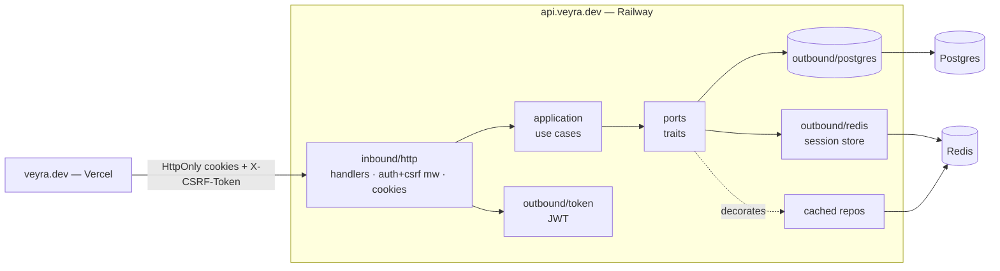

# Redis Auth (Access + Refresh + Cookies) & Caching — Implementation Plan

> **For agentic workers:** REQUIRED SUB-SKILL: Use superpowers:subagent-driven-development (recommended) or superpowers:executing-plans to implement this plan task-by-task. Steps use checkbox (`- [ ]`) syntax for tracking.

**Goal:** Replace the single long-lived JWT with short-lived access + rotating refresh tokens delivered as HttpOnly cookies, backed by a Redis session store, with session-id revocation, double-submit CSRF, and a transparent read cache.

**Architecture:** Hexagonal DDD single crate. New ports (`SessionStore`, extended `AuthPort`) stay domain-only; Redis lives in `adapters/outbound/redis/` and a relocated `adapters/outbound/token/`. Caching is a transparent repository decorator in the adapter layer (no cache port — keeps `serde` out of `ports/`). Cookie policy is environment-configurable so the same binary serves self-host (SameSite=Strict, `__Host-`) and the prod subdomain split (SameSite=Lax, `Domain`, `__Secure-`).

**Tech Stack:** Rust 2021, axum 0.8, sqlx 0.8 (PostgreSQL), `fred` 10 (Redis, feature `i-scripts`), `axum-extra` 0.10 (feature `cookie`), `sha2`, `rand`, `hex`, `base64`, `jsonwebtoken` 9, `argon2`. Tests: `testcontainers-modules` (features `postgres`, `redis`) + `axum-test`.

**Spec:** `docs/superpowers/specs/2026-06-27-redis-auth-cache-design.md` · **ADR:** `docs/adr/0006-refresh-tokens-redis-sessions-cache.md`

> **Decomposition principle (read first):** this plan uses **expand-contract**. Breaking changes to the
> `AuthPort` contract are made by ADDING the new methods alongside the old ones (Task 4), building
> everything on the new methods, then REMOVING the old methods inside the single atomic HTTP-swap task
> (Task 6) once no caller remains. Every task ends GREEN: `cargo build` + `cargo clippy -- -D warnings` +
> `cargo nextest run` all pass. Task 6 is intentionally the one large atomic task — the auth contract
> (bearer-token-in-body → cookies) cannot change in smaller slices without leaving integration tests red;
> everything separable has been pulled into the green additive tasks before it.

## Global Constraints

- **Hexagonal boundaries (CI-enforced, `.github/scripts/check-boundaries.sh`):** `domain/` may import only stdlib/`thiserror`/`uuid`/`chrono`/`rust_decimal`. `application/` may import `domain`+`ports` — never `axum`/`sqlx`. `ports/` may import `domain` only — never `axum`/`sqlx`/**`serde`**. Redis/cookie code lives in `adapters/`.
- **No `CachePort` in `ports/`.** Caching is transparent via decorators in `adapters/outbound/redis/`.
- **Token model:** access JWT HS256 `{ sub, sid, jti, iat, exp }` ~15 min; refresh opaque `{family_id}.{raw_secret}` ~7 days, Redis stores **SHA-256 hash** (never raw); CSRF random readable cookie, double-submit on all mutating protected routes. **Invariant: `sid == family_id`** (the access token's `sid` IS the refresh family id).
- **Fail modes:** read path (access revocation check) fails **open**; write path (logout, refresh) fails **closed**.
- **`sid` revocation:** one `revoke:{sid}` key invalidates all access tokens of a session. No per-`jti` denylist.
- **Cookie prefix derived from config:** `COOKIE_DOMAIN` unset + `COOKIE_SECURE=true` → `__Host-`; `COOKIE_DOMAIN` set → `__Secure-`; `COOKIE_SECURE=false` → no prefix. Refresh cookie is always `Path=/auth` → never `__Host-`.
- **CORS:** explicit allowlist from config + `Allow-Credentials: true`. Never wildcard `"*"`.
- **No `println!`** — `tracing::{debug,info,warn,error}!`.
- **Shared-file discipline:** `state.rs`, `redis/mod.rs`, `tests/common/mod.rs`, `Cargo.toml`, `application/auth/mod.rs` are edited by several tasks. Before editing one, READ its current content and PRESERVE prior tasks' additions — never blind-overwrite.

### Rust quality gate — write compliant from the first commit (NO Sonar; clippy is the gate)

```
- clippy::too_many_arguments — ≤7 params (aim ≤5); past that, a params struct / builder.
- clippy::cognitive_complexity — extract named helpers; early-return `?`; flatten with `let ... else`.
- NO `.unwrap()` / `.expect()` / `panic!` / `todo!()` on production paths — return `Result` + `?` /
  `ok_or_else` / `unwrap_or_default`. (Tests MAY unwrap/expect freely.)
- Duplicated string literal ≥3× → a module-level `const` (Redis key prefixes, cookie names, error strings).
- `#![forbid(unsafe_code)]` crate-wide.
- Errors: thiserror enums in domain/ports/application; map at the existing single ApiError IntoResponse point.
  Never `let _ = fallible();` (swallowed Result) unless the swallow is intentional and commented.
- Async: never hold a std::sync::Mutex across `.await`; never block the runtime; bound fan-out.
- Redis (fred): all keys via module consts; Lua `eval` for compare-and-swap (atomicity); never format untrusted into Lua.
- Verify before "done": cargo fmt --check → cargo clippy --all-targets --all-features -- -D warnings →
  cargo nextest run → cargo audit.
```

When fixing one instance of a rule, scan sibling files for the same shape and fix-forward.

### Existing interfaces (read before starting)

- `AuthPort` (`src/ports/auth.rs`): `sign_token(user_id) -> Result<String, AuthError>`, `verify_token(&str) -> Result<Uuid, AuthError>`; `AuthError::{InvalidToken, SigningFailed(String)}`. Current impl: `adapters/outbound/postgres/jwt_auth.rs`.
- `AppState` (`src/bootstrap/state.rs`): `new(pool: PgPool, jwt_secret: String)`; fields `pool`, `*_repo: Arc<dyn …>`, `auth: Arc<dyn AuthPort>`.
- `Config` (`src/bootstrap/config.rs`): `{ database_url, jwt_secret, port }`, `load()` (figment `Env::raw()` + `JWT_SECRET ≥ 32` guard).
- `LoginUseCase`/`RegisterUseCase` (`src/application/auth/`): currently return `String` (the JWT). Callers: `handlers/auth.rs` (`register`, `login` return `Json(TokenResponse { token })`).
- `VehicleRepository`/`SummaryRepository` (`src/ports/repositories.rs`): methods take `user_id`.
- Test helper `spawn_app()` (`tests/common/mod.rs`): Postgres testcontainer + `AppState` + `axum-test` `TestServer`. `register_and_login(app, email) -> String` returns the bearer token; tests send `Authorization: Bearer`.

---

## Task 1: Dependencies, audit triage, config, Redis pool, compose

**Files:** Modify `apps/backend/Cargo.toml`, `src/bootstrap/config.rs`, `src/adapters/outbound/mod.rs`, `apps/backend/.env.example`, `docker-compose.yml`, `apps/backend/.cargo/audit.toml`. Create `src/adapters/outbound/redis/{mod.rs,client.rs}`. Test: unit in `config.rs`.

**Interfaces — Produces:** `Config` gains `redis_url: String`, `access_ttl_secs: u64`(900), `refresh_ttl_secs: u64`(604800), `refresh_grace_secs: u64`(10), `cookie_secure: bool`(true), `cookie_samesite: SameSiteCfg`(Strict), `cookie_domain: Option<String>`, `cors_allowed_origins: Vec<String>`(default empty). `redis::client::build_pool(&str) -> anyhow::Result<fred::clients::Pool>`. `pub enum SameSiteCfg { Strict, Lax, None }` with `FromStr`.

**TDD: yes** — config defaults + `SameSiteCfg` parse + required-`REDIS_URL` validation. Big O: n/a.

- [ ] **Step 1 — deps.** Add to `[dependencies]`: `fred = { version = "10", features = ["i-scripts"] }`, `axum-extra = { version = "0.10", features = ["cookie"] }`, `sha2 = "0.10"`, `rand = "0.8"`, `hex = "0.4"`, `base64 = "0.22"`. Change dev `testcontainers-modules` to `features = ["postgres", "redis"]`. Run `cargo build`. (Use `cargo add` if a pin fails to resolve; keep the resolved version.)

- [ ] **Step 2 — audit triage.** Run `cargo audit`. For any NEW advisory from `fred`/`base64`/`hex`/their transitive deps, investigate with `cargo tree -i <crate>`. Only add an `ignore = ["RUSTSEC-XXXX-XXXX"]` entry to `apps/backend/.cargo/audit.toml` with a one-line justification comment if the crate is not actually compiled/exploitable; otherwise upgrade. Leave the existing `RUSTSEC-2023-0071` ignore intact.

- [ ] **Step 3 — failing config test.** Append to `config.rs`:
```rust
#[cfg(test)]
mod tests {
    use super::*;
    #[test]
    fn samesite_parses_case_insensitive() {
        assert_eq!("strict".parse::<SameSiteCfg>().unwrap(), SameSiteCfg::Strict);
        assert_eq!("LAX".parse::<SameSiteCfg>().unwrap(), SameSiteCfg::Lax);
        assert_eq!("None".parse::<SameSiteCfg>().unwrap(), SameSiteCfg::None);
        assert!("bogus".parse::<SameSiteCfg>().is_err());
    }
}
```
Run `cargo test --lib bootstrap::config -v` → FAIL.

- [ ] **Step 4 — implement config.** Replace `config.rs` body:
```rust
use anyhow::Result;
use figment::{providers::Env, Figment};
use serde::Deserialize;
use std::str::FromStr;

#[derive(Debug, Deserialize, Clone)]
pub struct Config {
    pub database_url: String,
    pub redis_url: String,
    pub jwt_secret: String,
    #[serde(default = "default_port")]
    pub port: u16,
    #[serde(default = "default_access_ttl")]
    pub access_ttl_secs: u64,
    #[serde(default = "default_refresh_ttl")]
    pub refresh_ttl_secs: u64,
    #[serde(default = "default_refresh_grace")]
    pub refresh_grace_secs: u64,
    #[serde(default = "default_cookie_secure")]
    pub cookie_secure: bool,
    #[serde(default)]
    pub cookie_samesite: SameSiteCfg,
    #[serde(default)]
    pub cookie_domain: Option<String>,
    #[serde(default)]
    pub cors_allowed_origins: Vec<String>,
}

#[derive(Debug, Clone, Copy, PartialEq, Eq, Deserialize, Default)]
#[serde(rename_all = "lowercase")]
pub enum SameSiteCfg { #[default] Strict, Lax, None }

impl FromStr for SameSiteCfg {
    type Err = String;
    fn from_str(s: &str) -> Result<Self, Self::Err> {
        match s.to_ascii_lowercase().as_str() {
            "strict" => Ok(Self::Strict),
            "lax" => Ok(Self::Lax),
            "none" => Ok(Self::None),
            other => Err(format!("invalid COOKIE_SAMESITE: {other}")),
        }
    }
}

fn default_port() -> u16 { 3000 }
fn default_access_ttl() -> u64 { 900 }
fn default_refresh_ttl() -> u64 { 604_800 }
fn default_refresh_grace() -> u64 { 10 }
fn default_cookie_secure() -> bool { true }

impl Config {
    pub fn load() -> Result<Self> {
        dotenvy::dotenv().ok();
        let config: Self = Figment::new().merge(Env::raw()).extract()?;
        anyhow::ensure!(config.jwt_secret.len() >= 32,
            "JWT_SECRET must be at least 32 bytes (got {})", config.jwt_secret.len());
        anyhow::ensure!(!config.redis_url.is_empty(), "REDIS_URL must be set");
        Ok(config)
    }
}
```
**Note:** figment parses `COOKIE_SAMESITE=lax` to the enum via `Deserialize`; `cors_allowed_origins` from a comma-or-JSON env is figment-dependent — accept a comma-separated `CORS_ALLOWED_ORIGINS` by a `#[serde(deserialize_with)]` splitter if needed, or document JSON-array form. Run `cargo test --lib bootstrap::config -v` → PASS.

- [ ] **Step 5 — Redis pool.** `redis/mod.rs`: `pub mod client;`. `redis/client.rs`:
```rust
use anyhow::Context;
use fred::clients::Pool;
use fred::prelude::*;

/// Builds and initializes a fred connection pool from a `redis://` URL.
pub async fn build_pool(redis_url: &str) -> anyhow::Result<Pool> {
    let config = Config::from_url(redis_url).context("invalid REDIS_URL")?;
    let pool = Builder::from_config(config).build_pool(8).context("failed to build Redis pool")?;
    pool.init().await.context("failed to connect to Redis")?;
    Ok(pool)
}
```
Add `pub mod redis;` to `adapters/outbound/mod.rs`. `cargo build` → OK.

- [ ] **Step 6 — env + compose.** Append to `.env.example`: `REDIS_URL=redis://localhost:6379`, `ACCESS_TTL_SECS=900`, `REFRESH_TTL_SECS=604800`, `REFRESH_GRACE_SECS=10`, `COOKIE_SECURE=false`, `COOKIE_SAMESITE=strict`, `# COOKIE_DOMAIN=veyra.dev`, `# CORS_ALLOWED_ORIGINS=https://veyra.dev`. In `docker-compose.yml` add a `redis` service (`redis:7-alpine`, `command: ["redis-server","--appendonly","yes"]`, `redis_data:/data` volume, `redis-cli ping` healthcheck, NO published `ports:`); add `REDIS_URL: redis://redis:6379` + `depends_on: redis: {condition: service_healthy}` to `backend`; add `redis_data:` volume.

- [ ] **Step 7 — gate + commit.** `cargo fmt && cargo clippy --all-targets --all-features -- -D warnings && cargo nextest run --lib`.
```bash
git add apps/backend/Cargo.toml apps/backend/Cargo.lock apps/backend/.cargo/audit.toml apps/backend/src/bootstrap/config.rs apps/backend/src/adapters/outbound apps/backend/.env.example docker-compose.yml
git commit -m "feat(redis): fred pool, cookie/ttl/cors config, compose redis service"
```

---

## Task 2: SessionStore port + RedisSessionStore (atomic rotate, revoke); test helper

**Files:** Create `src/ports/session.rs`, `src/adapters/outbound/redis/session_store.rs`. Modify `src/ports/mod.rs`, `redis/mod.rs`, `tests/common/mod.rs`. Test: `tests/session_store_test.rs` (integration, Redis container).

**Interfaces — Produces:**
```rust
// ports/session.rs — NOTE: sid == family_id by definition (the access sid IS the refresh family id).
pub struct NewSession { pub family_id: Uuid, pub raw_secret: String }
#[derive(Debug)]
pub enum RotateOutcome { Rotated { user_id: Uuid, new_raw_secret: String }, Reused, NotFound }
#[derive(Debug, thiserror::Error)]
pub enum SessionError { #[error("session store unavailable: {0}")] Unavailable(String) }
pub type SessionResult<T> = Result<T, SessionError>;

#[async_trait::async_trait]
pub trait SessionStore: Send + Sync {
    async fn create(&self, user_id: Uuid) -> SessionResult<NewSession>;
    async fn rotate(&self, family_id: Uuid, presented_secret: &str) -> SessionResult<RotateOutcome>;
    async fn revoke(&self, family_id: Uuid) -> SessionResult<()>;
    /// Writes `revoke:{sid}` with TTL = access-token lifetime; invalidates all access tokens of the session.
    async fn revoke_session(&self, sid: Uuid, ttl_secs: u64) -> SessionResult<()>;
    async fn is_session_revoked(&self, sid: Uuid) -> SessionResult<bool>;
}
```
This task is **purely additive** (new port + new adapter + a standalone test helper) — nothing existing imports it yet, so the crate stays green.

**TDD: yes (integration).** **Big O:** every op is O(1) — one key per family/sid, no scans; the Lua script does constant field reads/writes. (Dispatch note in Bahasa Indonesia: tiap operasi O(1), satu key per family, gak ada scan.)

- [ ] **Step 1 — port.** Write `ports/session.rs` (block above); add `pub mod session;` to `ports/mod.rs`.

- [ ] **Step 2 — failing integration test.** `tests/session_store_test.rs`:
```rust
mod common;
use common::{redis_store, redis_store_with_grace};
use uuid::Uuid;
use veyra::ports::session::{RotateOutcome, SessionStore};

#[tokio::test]
async fn rotate_then_old_secret_after_grace_is_reused_and_revokes() {
    let (store, _g) = redis_store().await; // grace = 0
    let uid = Uuid::new_v4();
    let s = store.create(uid).await.unwrap();
    let new1 = match store.rotate(s.family_id, &s.raw_secret).await.unwrap() {
        RotateOutcome::Rotated { new_raw_secret, user_id } => { assert_eq!(user_id, uid); new_raw_secret }
        o => panic!("expected Rotated, got {o:?}"),
    };
    assert!(matches!(store.rotate(s.family_id, &s.raw_secret).await.unwrap(), RotateOutcome::Reused));
    assert!(matches!(store.rotate(s.family_id, &new1).await.unwrap(), RotateOutcome::NotFound));
}

#[tokio::test]
async fn in_grace_previous_secret_still_rotates() {
    let (store, _g) = redis_store_with_grace(5).await;
    let s = store.create(Uuid::new_v4()).await.unwrap();
    let _ = store.rotate(s.family_id, &s.raw_secret).await.unwrap();
    assert!(matches!(store.rotate(s.family_id, &s.raw_secret).await.unwrap(), RotateOutcome::Rotated { .. }));
}

#[tokio::test]
async fn revoke_session_then_is_revoked_true() {
    let (store, _g) = redis_store().await;
    let sid = Uuid::new_v4();
    store.revoke_session(sid, 900).await.unwrap();
    assert!(store.is_session_revoked(sid).await.unwrap());
    assert!(!store.is_session_revoked(Uuid::new_v4()).await.unwrap());
}
```
Run `cargo nextest run --test session_store_test` → FAIL.

- [ ] **Step 3 — implement `RedisSessionStore`.** `redis/session_store.rs`:
```rust
use async_trait::async_trait;
use base64::Engine;
use fred::clients::Pool;
use fred::prelude::*;
use rand::RngCore;
use sha2::{Digest, Sha256};
use uuid::Uuid;

use crate::ports::session::{NewSession, RotateOutcome, SessionError, SessionResult, SessionStore};

const SESSION_PREFIX: &str = "session:";
const REVOKE_PREFIX: &str = "revoke:";

/// Atomic rotate. KEYS[1]=session key; ARGV=[presented_hash,new_hash,grace_secs,refresh_ttl,now].
/// Returns {status, user_id?}. status: ROTATED | REUSED | NOTFOUND.
const ROTATE_LUA: &str = r#"
local key=KEYS[1]
if redis.call('EXISTS',key)==0 then return {'NOTFOUND'} end
local cur=redis.call('HGET',key,'current')
local prev=redis.call('HGET',key,'prev')
local pu=tonumber(redis.call('HGET',key,'prev_until') or '0')
local uid=redis.call('HGET',key,'user_id')
local presented=ARGV[1]
local now=tonumber(ARGV[5])
local in_grace=(prev~=false and prev==presented and now<pu)
if presented==cur or in_grace then
  redis.call('HSET',key,'prev',cur,'prev_until',now+tonumber(ARGV[3]),'current',ARGV[2])
  redis.call('EXPIRE',key,tonumber(ARGV[4]))
  return {'ROTATED',uid}
end
return {'REUSED'}
"#;

#[derive(Clone)]
pub struct RedisSessionStore { pool: Pool, refresh_ttl_secs: u64, grace_secs: u64 }

fn hash_secret(raw: &str) -> String { let mut h = Sha256::new(); h.update(raw.as_bytes()); hex::encode(h.finalize()) }
fn random_secret() -> String { let mut b=[0u8;32]; rand::thread_rng().fill_bytes(&mut b); base64::engine::general_purpose::URL_SAFE_NO_PAD.encode(b) }
fn map_err(e: Error) -> SessionError { SessionError::Unavailable(e.to_string()) }

impl RedisSessionStore {
    pub fn new(pool: Pool, refresh_ttl_secs: u64, grace_secs: u64) -> Self { Self { pool, refresh_ttl_secs, grace_secs } }
    fn skey(f: Uuid) -> String { format!("{SESSION_PREFIX}{f}") }
    fn rkey(s: Uuid) -> String { format!("{REVOKE_PREFIX}{s}") }
}

#[async_trait]
impl SessionStore for RedisSessionStore {
    async fn create(&self, user_id: Uuid) -> SessionResult<NewSession> {
        let family_id = Uuid::new_v4();
        let raw_secret = random_secret();
        let key = Self::skey(family_id);
        let fields = vec![
            ("user_id", user_id.to_string()), ("current", hash_secret(&raw_secret)),
            ("prev", String::new()), ("prev_until", "0".to_string()),
        ];
        let _: () = self.pool.hset(&key, fields).await.map_err(map_err)?;
        let _: () = self.pool.expire(&key, self.refresh_ttl_secs as i64, None).await.map_err(map_err)?;
        Ok(NewSession { family_id, raw_secret })
    }
    async fn rotate(&self, family_id: Uuid, presented_secret: &str) -> SessionResult<RotateOutcome> {
        let new_secret = random_secret();
        let now = chrono::Utc::now().timestamp();
        let out: Vec<String> = self.pool.eval(ROTATE_LUA, vec![Self::skey(family_id)], vec![
            hash_secret(presented_secret), hash_secret(&new_secret),
            self.grace_secs.to_string(), self.refresh_ttl_secs.to_string(), now.to_string(),
        ]).await.map_err(map_err)?;
        match out.first().map(String::as_str) {
            Some("ROTATED") => {
                let user_id = out.get(1).and_then(|s| s.parse().ok())
                    .ok_or_else(|| SessionError::Unavailable("missing user_id".into()))?;
                Ok(RotateOutcome::Rotated { user_id, new_raw_secret: new_secret })
            }
            Some("REUSED") => Ok(RotateOutcome::Reused),
            _ => Ok(RotateOutcome::NotFound),
        }
    }
    async fn revoke(&self, family_id: Uuid) -> SessionResult<()> {
        let _: () = self.pool.del(Self::skey(family_id)).await.map_err(map_err)?; Ok(())
    }
    async fn revoke_session(&self, sid: Uuid, ttl_secs: u64) -> SessionResult<()> {
        let _: () = self.pool.set(Self::rkey(sid), "1", Some(Expiration::EX(ttl_secs as i64)), None, false)
            .await.map_err(map_err)?; Ok(())
    }
    async fn is_session_revoked(&self, sid: Uuid) -> SessionResult<bool> {
        let exists: bool = self.pool.exists(Self::rkey(sid)).await.map_err(map_err)?; Ok(exists)
    }
}
```
Add `pub mod session_store;` to `redis/mod.rs`.

- [ ] **Step 4 — test helper.** In `tests/common/mod.rs` (READ current content first, preserve existing Postgres helpers), add:
```rust
use testcontainers_modules::redis::Redis;
use veyra::adapters::outbound::redis::{client::build_pool, session_store::RedisSessionStore};

pub async fn redis_store() -> (RedisSessionStore, impl Sized) { redis_store_with_grace(0).await }
pub async fn redis_store_with_grace(grace: u64) -> (RedisSessionStore, impl Sized) {
    let container = Redis::default().start().await.unwrap();
    let port = container.get_host_port_ipv4(6379).await.unwrap();
    let pool = build_pool(&format!("redis://127.0.0.1:{port}")).await.unwrap();
    (RedisSessionStore::new(pool, 604_800, grace), container)
}
```
Run `cargo nextest run --test session_store_test` → PASS (Docker required).

- [ ] **Step 5 — gate + commit.** Full gate, then `git add -A apps/backend && git commit -m "feat(session): Redis session store with atomic Lua rotation + sid revocation"`.

---

## Task 3: Cookie builder (pure, additive)

**Files:** Create `src/adapters/inbound/http/cookies.rs`. Modify `src/adapters/inbound/http/mod.rs` (`pub mod cookies;`). Test: unit in `cookies.rs`. Purely additive — green.

**Interfaces — Produces:**
```rust
pub struct CookiePolicy { pub secure: bool, pub samesite: SameSiteCfg, pub domain: Option<String>,
    pub access_ttl_secs: u64, pub refresh_ttl_secs: u64 }
pub const ACCESS_BASE: &str = "veyra_access";
pub const REFRESH_BASE: &str = "veyra_refresh";
pub const CSRF_BASE: &str = "veyra_csrf";
pub fn access_name(p: &CookiePolicy) -> String;   // __Host-/__Secure-/none
pub fn refresh_name(p: &CookiePolicy) -> String;   // never __Host- (Path=/auth)
pub fn csrf_name(p: &CookiePolicy) -> String;
pub fn access_cookie(p: &CookiePolicy, value: &str) -> Cookie<'static>;   // HttpOnly, Path=/
pub fn refresh_cookie(p: &CookiePolicy, value: &str) -> Cookie<'static>;  // HttpOnly, Path=/auth
pub fn csrf_cookie(p: &CookiePolicy, value: &str) -> Cookie<'static>;     // readable, Path=/
pub enum CookieKind { Access, Refresh, Csrf }
pub fn clear(p: &CookiePolicy, kind: CookieKind) -> Cookie<'static>;      // Max-Age=0, matching attrs
pub fn random_token() -> String;  // 32B base64url; used for CSRF token generation in handlers
```

**TDD: yes** — prefix derivation + attribute matrix is pure logic. Big O: n/a.

- [ ] **Step 1 — failing tests.** In `cookies.rs`:
```rust
#[cfg(test)]
mod tests {
    use super::*;
    use crate::bootstrap::config::SameSiteCfg;
    fn policy(secure: bool, domain: Option<&str>) -> CookiePolicy {
        CookiePolicy { secure, samesite: SameSiteCfg::Strict, domain: domain.map(String::from), access_ttl_secs: 900, refresh_ttl_secs: 604_800 }
    }
    #[test] fn host_prefix_when_secure_no_domain() {
        let p = policy(true, None);
        assert_eq!(access_name(&p), "__Host-veyra_access");
        assert_eq!(refresh_name(&p), "__Secure-veyra_refresh");
    }
    #[test] fn secure_prefix_when_domain_set() {
        assert_eq!(access_name(&policy(true, Some("veyra.dev"))), "__Secure-veyra_access");
    }
    #[test] fn no_prefix_when_insecure() { assert_eq!(access_name(&policy(false, None)), "veyra_access"); }
    #[test] fn refresh_scoped_to_auth_path() {
        let c = refresh_cookie(&policy(true, None), "fam.secret");
        assert_eq!(c.path(), Some("/auth")); assert_eq!(c.http_only(), Some(true));
    }
    #[test] fn csrf_is_readable() { assert_ne!(csrf_cookie(&policy(true, None), "t").http_only(), Some(true)); }
}
```
Run `cargo test --lib http::cookies -v` → FAIL.

- [ ] **Step 2 — implement.** Use `axum_extra::extract::cookie::{Cookie, SameSite}`, `cookie::time::Duration`, `base64`+`rand` for `random_token`. Prefix rule per Global Constraints. Builders set `http_only`(access/refresh true, csrf false), `secure`, `same_site` (map `SameSiteCfg`), `path` (`/` access/csrf, `/auth` refresh), `max_age` (from matching TTL), `domain` if set (NOT under `__Host-`). `clear` returns same name/path/domain with `max_age(Duration::ZERO)`. Run `cargo test --lib http::cookies -v` → PASS.

- [ ] **Step 3 — gate + commit.** `git commit -m "feat(http): env-driven cookie builder with prefix derivation"`.

---

## Task 4: AuthPort EXPAND — add access methods alongside legacy; move JwtAuth to token/

**Files:** Modify `src/ports/auth.rs` (ADD methods, keep old). Create `src/adapters/outbound/token/{mod.rs,jwt_auth.rs}` (moved + extended). Delete `postgres/jwt_auth.rs`; update `postgres/mod.rs`, `adapters/outbound/mod.rs`, `state.rs` import + construction. Update `MockAuth` in `application/auth/login.rs` tests. Test: unit in `token/jwt_auth.rs`.

> **Expand-contract step 1 (expand):** `AuthPort` KEEPS `sign_token`/`verify_token` AND gains
> `sign_access`/`verify_access`/`AccessClaims`. All existing callers (login/register use cases, middleware,
> MockAuth) keep compiling against the legacy methods. The crate stays GREEN. The legacy methods are
> removed in Task 6 once no caller remains.

**Interfaces — Produces:** `AccessClaims { user_id, sid, jti }`; `sign_access(user_id, sid, jti) -> Result<String, AuthError>`; `verify_access(&str) -> Result<AccessClaims, AuthError>`; `JwtAuth::new(secret, access_ttl_secs)`.

**TDD: yes** — sign/verify roundtrip preserves sub/sid/jti; wrong-secret + expired reject. Big O: n/a.

- [ ] **Step 1 — expand `AuthPort`.** `ports/auth.rs`: keep `AuthError`; add `#[derive(Debug, Clone, PartialEq, Eq)] pub struct AccessClaims { pub user_id: Uuid, pub sid: Uuid, pub jti: Uuid }`; extend the trait to declare BOTH the legacy `sign_token`/`verify_token` AND `sign_access`/`verify_access`.

- [ ] **Step 2 — failing tests** in new `token/jwt_auth.rs` (the three tests from the design: `sign_and_verify_preserves_claims`, `verify_rejects_wrong_secret`, `verify_rejects_expired` using `JwtAuth::new(secret, ttl)` and `sign_access`/`verify_access`). Create `token/mod.rs` = `pub mod jwt_auth;`; add `pub mod token;` to `adapters/outbound/mod.rs`. Run `cargo test --lib token::jwt_auth -v` → FAIL.

- [ ] **Step 3 — implement `JwtAuth`** with BOTH method sets (legacy `sign_token`/`verify_token` retained verbatim from the old file + new `sign_access`/`verify_access` with the `{ sub, sid, jti, iat, exp }` claims and `access_ttl_secs`). `JwtAuth::new(secret: String, access_ttl_secs: u64)`. (Legacy `sign_token` ignores `access_ttl_secs`, keeps its 7-day default for now — it is removed in Task 6.)

- [ ] **Step 4 — relocate + rewire.** `rm src/adapters/outbound/postgres/jwt_auth.rs`; remove its `pub mod` from `postgres/mod.rs`. In `state.rs` change import to `crate::adapters::outbound::token::jwt_auth::JwtAuth` and construct `JwtAuth::new(jwt_secret, 900)` (the real `access_ttl_secs` is threaded in Task 6). Update `MockAuth` in `login.rs` tests to implement BOTH method sets. Run `cargo test --lib token::jwt_auth -v` → PASS; `cargo build` → OK; full `cargo nextest run --lib` → PASS.

- [ ] **Step 5 — gate + commit.** `git add -A apps/backend/src && git commit -m "feat(auth): add access-token methods to AuthPort (expand); move JwtAuth to token adapter"`.

---

## Task 5: RefreshUseCase + LogoutUseCase (additive policy)

**Files:** Create `src/application/auth/refresh.rs`, `logout.rs`. Modify `src/application/auth/mod.rs` (READ first; add `pub mod refresh; pub mod logout;` and define `AuthSession`). Test: unit (fake `SessionStore` + fake `AuthPort`). Additive — green.

**Interfaces — Produces:**
```rust
pub struct AuthSession { pub access_token: String, pub family_id: Uuid, pub raw_secret: String, pub sid: Uuid }
pub struct RefreshOutput { pub access_token: String, pub family_id: Uuid, pub raw_secret: String }
pub enum RefreshError { Invalid, Unavailable }  // Invalid→401, Unavailable→503
pub enum LogoutError { Unavailable }             // →503 (fail-closed)
RefreshUseCase { sessions, auth, access_ttl_secs }::execute(family_id, presented_secret) -> Result<RefreshOutput, RefreshError>
LogoutUseCase { sessions, access_ttl_secs }::execute(family_id, sid) -> Result<(), LogoutError>
```
`AuthSession` is produced by register/login in Task 6 (`sid == family_id`).

**TDD: yes** — outcome→action mapping + fail-closed; fakes. Big O: O(1).

- [ ] **Step 1 — failing tests.** `refresh.rs` test module: fake `SessionStore` returning a configured `RotateOutcome` and recording calls; fake `AuthPort` (`sign_access` → `"mock.jwt"`). Assert: `Rotated`→`Ok(RefreshOutput{access_token:"mock.jwt",..})`; `Reused`→`Err(Invalid)` AND fake recorded `revoke`+`revoke_session`; `NotFound`→`Err(Invalid)`; store `Err(Unavailable)`→`Err(Unavailable)`. `logout.rs`: both store writes ok→`Ok(())`; either `Unavailable`→`Err(Unavailable)`. Run `cargo test --lib application::auth -v` → FAIL.

- [ ] **Step 2 — implement** `RefreshUseCase` and `LogoutUseCase` exactly as in the design spec §4.4/§4.5 (Rotated → sign new access with `family_id` as `sid` + `Uuid::new_v4()` jti; Reused → `revoke` + `revoke_session(family_id, access_ttl_secs)` then `Err(Invalid)`; store error → `Unavailable`. Logout → `revoke` then `revoke_session`, any error → `Err(Unavailable)`). Define `AuthSession` in `application/auth/mod.rs`. Run `cargo test --lib application::auth -v` → PASS.

- [ ] **Step 3 — gate + commit.** `git commit -m "feat(auth): refresh (rotation + theft response) and logout (fail-closed) use cases"`.

---

## Task 6: ATOMIC auth swap — register/login cookies, middleware, refresh/logout, router, CORS, wiring, test migration, contract removal

> **The one large atomic task.** Switching the auth contract from bearer-token-in-body to HttpOnly
> cookies cannot be done in smaller green slices — the moment login stops returning a body token, every
> integration test breaks until the middleware, handlers, and test harness all move together. Everything
> separable (session store, use cases, cookie builder, AuthPort expand) already landed green in Tasks 1–5.
> This task also performs the expand-contract CONTRACT step (removes the legacy `sign_token`/`verify_token`).

**Files:** Modify `bootstrap/state.rs`, `bootstrap/main.rs` (actually `src/main.rs`), `middleware/auth.rs`, create `middleware/csrf.rs` (+ `middleware/mod.rs`), `handlers/auth.rs`, `router.rs`, `ports/auth.rs` (remove legacy), `token/jwt_auth.rs` (remove legacy), `tests/common/mod.rs`, ALL `tests/*_test.rs`. Test: extend `tests/auth_test.rs`.

**Interfaces — Consumes:** Tasks 1–5. **Produces:** `AppState::new(pool, redis_pool: fred::clients::Pool, config: &Config)`; fields `sessions: Arc<dyn SessionStore>`, `cookie_policy: CookiePolicy`; `auth` now uses `config.access_ttl_secs`.

**TDD: integration** (end-to-end cookie/refresh/logout/CSRF; unit pieces already covered). Big O: middleware = O(1) verify + one O(1) `EXISTS`.

- [ ] **Step 1 — AppState + main + CORS.** READ `state.rs` first. `AppState::new(pool, redis_pool, config: &Config)`: build `RedisSessionStore::new(redis_pool, config.refresh_ttl_secs, config.refresh_grace_secs)` → `sessions`; `JwtAuth::new(config.jwt_secret.clone(), config.access_ttl_secs)`; `cookie_policy` from config; keep all repo fields. Add `sessions` + `cookie_policy` fields. In `src/main.rs`: `let redis_pool = redis::client::build_pool(&config.redis_url).await?; let state = AppState::new(pool, redis_pool, &config);`. Build a `CorsLayer` from `config.cors_allowed_origins` (parse each to `HeaderValue`), `.allow_credentials(true)`, `.allow_methods([...])`, `.allow_headers([...including x-csrf-token...])` — **never `Any` when credentials are allowed**; if the origins list is empty, apply no permissive CORS (same-origin only). Attach to the router in `main`/`router::build`.

- [ ] **Step 2 — auth middleware (cookie + sid, fail-open, clear-on-401).** Rewrite `require_auth` to read the access cookie via `CookieJar::from_headers`, `verify_access`, then `is_session_revoked(claims.sid)` FAIL-OPEN (Ok(true)→reject, Err→warn+allow). On any rejection, return a response that **clears** access/refresh/csrf cookies (build a `CookieJar` of `clear(...)` cookies + `StatusCode::UNAUTHORIZED` into a `Response`), per Codex #4. Inject `claims.user_id`.

- [ ] **Step 3 — CSRF middleware.** Create `middleware/csrf.rs` `require_csrf` (GET/HEAD/OPTIONS pass; else compare `X-CSRF-Token` header to the csrf cookie via `csrf_name(&state.cookie_policy)`; mismatch/missing → 403). Add `pub mod csrf;` to `middleware/mod.rs`.

- [ ] **Step 4 — handlers.** In `handlers/auth.rs`: `register`/`login` call the use case (now returning `AuthSession`; see Step 7) → build a `CookieJar` with `access_cookie`, `refresh_cookie("{family_id}.{raw_secret}")`, `csrf_cookie(random_token())`; return `(StatusCode, jar, Json(UserResponse))` — NO body token. `refresh`: read refresh cookie, split on the first `.` into `family_id`+`secret`; `RefreshUseCase::execute` → Ok sets fresh access+refresh+csrf cookies (200); `Err(Invalid)`→clear cookies+401; `Err(Unavailable)`→503. `logout`: read access cookie → `verify_access` for `sid`; read refresh cookie for `family_id`; `LogoutUseCase::execute(family_id, sid)` → Ok clears all cookies+204; `Err(Unavailable)`→503 (cookies NOT cleared). `me` unchanged.

- [ ] **Step 5 — router.** Add `/auth/refresh` + `/auth/logout` (POST) to the public group; apply `require_csrf` as a layer on the protected router (after `require_auth`). Keep register/login/refresh CSRF-exempt (public group).

- [ ] **Step 6 — migrate test harness + all tests.** READ `tests/common/mod.rs` first. `spawn_app` starts Postgres AND Redis containers, builds the redis pool, calls `AppState::new(pool, redis_pool, &test_config)` (test config: `cookie_secure=false`, `samesite=Strict`, no domain, empty CORS, short-ish TTLs). Use `TestServer::builder().save_cookies().build()`. Rewrite `register_and_login(app, email)` to register+login (cookies stored in jar) and return the **csrf token** (read from the csrf cookie). Add `fn csrf_header(token: &str) -> (HeaderName, HeaderValue)`. Update EVERY mutating request across all integration test files to attach the csrf header. Run `cargo nextest run` → PASS.

- [ ] **Step 7 — register/login create session.** Update `LoginUseCase`/`RegisterUseCase` to hold `sessions: Arc<dyn SessionStore>` + `access_ttl_secs`, and return `AuthSession` (create session, `sign_access(user.id, family_id, jti)`, `sid = family_id`). Update their unit tests (fake SessionStore). Wire the new fields wherever the use cases are constructed (handlers/state).

- [ ] **Step 8 — extend `auth_test.rs`.** Add: refresh rotates + old refresh cookie rejected after grace; logout → `/me` 401 (sid revoked); POST without `X-CSRF-Token` → 403; login sets HttpOnly access cookie (assert no token in body). Run `cargo nextest run --test auth_test` → PASS.

- [ ] **Step 9 — CONTRACT: remove legacy.** Delete `sign_token`/`verify_token` from `AuthPort`, `JwtAuth`, and `MockAuth` (no callers remain). Run full `cargo nextest run` → PASS.

- [ ] **Step 10 — full gate + commit.** `cargo fmt && cargo clippy --all-targets --all-features -- -D warnings && cargo nextest run && cargo audit`.
```bash
git add -A apps/backend
git commit -m "feat(auth): cookie access/refresh auth, refresh+logout endpoints, CSRF, CORS; migrate tests; drop legacy JWT API"
```

---

## Task 7: RedisCache + CachedVehicleRepo decorator

**Files:** Create `redis/cache.rs`, `redis/cached_vehicle_repo.rs`. Modify `redis/mod.rs`, `state.rs` (READ first; wrap `vehicle_repo`). Test: `tests/vehicle_cache_test.rs`. Additive decorator — green.

**Interfaces — Produces:** `RedisCache::new(pool)` (adapter-internal `get_json`/`set_json`/`bump_version`/`version`, all fail-open). `CachedVehicleRepo { inner: Arc<dyn VehicleRepository>, cache: RedisCache }` impl `VehicleRepository`.

**TDD: integration.** **Big O:** cache hit O(1) avoids the SQL round-trip; keys O(1) by `user_id`(+`vehicle_id`); write = one `INCR` invalidates all of a user's read keys without a scan. (Dispatch in Bahasa Indonesia: read → cache O(1); miss → PG by index O(log n); write → INCR O(1), invalidasi seluruh read-key user tanpa scan.)

- [ ] **Step 1 — failing test** (`vehicle_cache_test.rs`): list → 1 vehicle; create a 2nd (write bumps version); list → 2 vehicles (no stale cache). Cross-user: user B's list never returns user A's vehicles after A populated the cache. Run → FAIL.
- [ ] **Step 2 — `RedisCache`** (serde_json; `get_json<T: DeserializeOwned>`→`None` on miss/any error logged at debug; `set_json<T: Serialize>` ignores errors; `bump_version(user)`→`INCR cache:ver:{user}` returns new; `version(user)`→read, absent=0). Keys: `cache:v{ver}:vehicles:{user}`, `cache:v{ver}:vehicle:{user}:{id}`. Consts for prefixes.
- [ ] **Step 3 — `CachedVehicleRepo`.** Private `#[derive(Serialize,Deserialize)] struct VehicleCacheModel` mirroring `Vehicle` (value objects via string/int reprs) + `From<Vehicle>`/`into`. `list_by_user`/`find_by_id` read-through with version-prefixed keys; `insert`/`update`/`delete` call `inner` first then `cache.bump_version(user_id)` on success. Mapping confined to this file (domain stays serde-free).
- [ ] **Step 4 — wire** in `state.rs`: `vehicle_repo: Arc<dyn VehicleRepository> = Arc::new(CachedVehicleRepo::new(Arc::new(PgVehicleRepo::new(pool.clone())), RedisCache::new(redis_pool.clone())))`. Run `cargo nextest run --test vehicle_cache_test` + full suite → PASS.
- [ ] **Step 5 — gate + commit.** `git commit -m "feat(cache): transparent CachedVehicleRepo with per-user version invalidation"`.

---

## Task 8: CachedSummaryRepo (TTL 60s)

**Files:** Create `redis/cached_summary_repo.rs`. Modify `redis/mod.rs`, `state.rs` (READ first; wrap `summary_repo`). Test: `tests/summary_cache_test.rs`. Additive — green.

**Interfaces — Produces:** `CachedSummaryRepo { inner: Arc<dyn SummaryRepository>, cache: RedisCache }` impl `SummaryRepository`. Key `cache:summary:{user_id}:{vehicle_id}`, TTL 60s, no invalidation.

**TDD: integration.** Big O: O(1).

- [ ] **Step 1 — failing test** (`summary_cache_test.rs`): summary aggregates correct; second call within TTL served from cache; cross-user isolation (B cannot read A's summary key). Run → FAIL.
- [ ] **Step 2 — implement** with private `SummaryCacheModel` serde mirror; `get_summary` read-through `cache:summary:{user}:{vehicle}`, miss → `inner` → `set_json(key,&model,60)`; errors fail-open to `inner`.
- [ ] **Step 3 — wire** `summary_repo` in `state.rs` (wrap `PgSummaryRepo`). Run tests + full suite → PASS.
- [ ] **Step 4 — gate + commit.** `git commit -m "feat(cache): CachedSummaryRepo with 60s TTL"`.

---

## Task 9: Deploy config (railway.toml) + README rewrite + architecture diagram

**Files:** Create `railway.toml` (repo root). Modify `README.md`. Test: none (docs/ops); the full gate is the deliverable check.

**TDD: not applicable** (docs/config). Verify-by: full gate green; README + Mermaid render.

- [ ] **Step 1 — `railway.toml`** (repo root):
```toml
[build]
builder = "dockerfile"
dockerfilePath = "apps/backend/Dockerfile"

[deploy]
healthcheckPath = "/health"
restartPolicyType = "on_failure"
```
Document in README: Railway service Root Directory = repo root; attach managed Postgres + Redis (inject `DATABASE_URL`/`REDIS_URL`); set `COOKIE_DOMAIN=veyra.dev`, `COOKIE_SAMESITE=lax`, `COOKIE_SECURE=true`, `CORS_ALLOWED_ORIGINS=https://veyra.dev`, `JWT_SECRET`.

- [ ] **Step 2 — README rewrite.** Remove ALL emoji; use plain text / restrained Unicode glyphs (`›`,`—`,`▸`) only where a marker aids scanning. Refresh sections: Stack (add Redis/fred/axum-extra); Auth (access+refresh cookies, CSRF, `/auth/refresh` + `/auth/logout`, the self-host-vs-prod env matrix table); Configuration (full env table incl. cookie + CORS vars); Local dev (`docker compose up` now includes Redis); Deployment (Railway backend via `railway.toml` + managed Postgres/Redis; future Vercel FE under `veyra.dev`; CORS allowlist + cookie domain). Professional English (disk artifact).

- [ ] **Step 3 — architecture diagram.** Add a Mermaid diagram to README: hexagonal layers (domain ← application ← ports ← adapters: inbound HTTP / outbound Postgres / outbound Redis session+cache / outbound token / bootstrap) + request/auth/cache flow + deploy topology (Vercel `veyra.dev` → Railway `api.veyra.dev` → managed Postgres + Redis). Skeleton:

Verify it renders on GitHub.

- [ ] **Step 4 — final gate + commit.** `cargo fmt --check && cargo clippy --all-targets --all-features -- -D warnings && cargo nextest run && cargo audit`.
```bash
git add railway.toml README.md
git commit -m "docs: railway deploy config, README rewrite (icons, no emoji), architecture diagram"
```

---

## Notes for the executor

- **Docker required** for every integration suite (Postgres + Redis testcontainers). After a fresh Docker Desktop start, the first container creation can lag — retry rather than assume breakage.
- **`cargo audit`:** existing `.cargo/audit.toml` ignores `RUSTSEC-2023-0071`. New deps may surface advisories — triage (Task 1 Step 2); only ignore with justification.
- **Boundary CI:** `serde` in `ports/session.rs` fails `.github/scripts/check-boundaries.sh`. `RotateOutcome`/`NewSession` use only `uuid`/`String` — keep it that way.
- **Each task ends green** (`build` + `clippy -D warnings` + `nextest`). Task 6 is the single atomic exception in size, not in greenness — it still ends fully green.
- **`sid == family_id`** everywhere: the access token's `sid` claim IS the refresh family id; logout/refresh rely on this.
